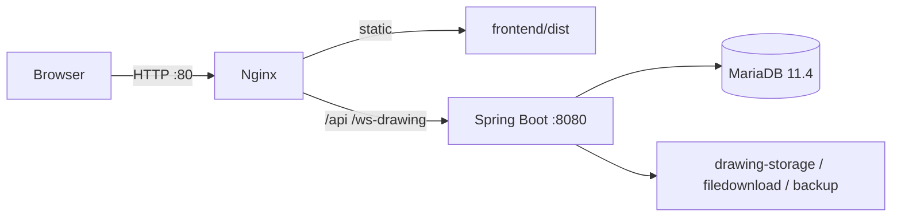

# EC2 Smart-Manager 배포 요건 체크리스트

**전제**: OS는 **Amazon Linux 2023**. 공인 IP `52.78.102.6`로 HTTP 접속. **JDK 17**·MariaDB 11.4·Nginx는 EC2에 이미 설치됨. 도메인/HTTPS는 추후 확장 항목.

관련 설정 초안:

- [application-prod.yml](../../smartmanager_backend/smartmanager-api/src/main/resources/application-prod.yml)
- [deploy/nginx/smartmanager.conf](../../deploy/nginx/smartmanager.conf)
- [deploy/systemd/smartmanager-api.service](../../deploy/systemd/smartmanager-api.service)
- [deploy/README.md](../../deploy/README.md)

---

## 배포 아키텍처 (권장)



프론트는 `/api`·`/ws-drawing` **상대 경로**를 쓰므로, Nginx가 동일 오리진으로 API·WebSocket을 프록시합니다.

---

## 1. EC2 / OS 사전 요건

- [ ] OS: **Amazon Linux 2023** (확정)
- [ ] SSH 사용자: `ec2-user`
- [ ] 보안 그룹 인바운드: **22**(SSH), **80**(HTTP). **8080은 외부 미개방**
- [ ] SSH 키 페어로 접속 가능
- [ ] 디스크: 도면 PDF·첨부·백업용 여유 공간 (수십 GB 권장)
- [ ] 시간대: `Asia/Seoul` (`sudo timedatectl set-timezone Asia/Seoul`)
- [ ] 기설치 확인: **JDK 17**, MariaDB 11.4, Nginx

---

## 2. 런타임 확인·선택 설치 (Amazon Linux 2023)

- [x] **JDK 17** — **이미 설치됨** (재설치 불필요). 버전만 확인:

```bash
java -version
# 17.x 인지 확인 (Spring Boot 3.5 요구)
```

- [ ] **Node.js 20 LTS**(또는 22) — 서버에서 프론트 빌드 시만 필요. 로컬/CI에서 `dist`만 올리면 불필요

```bash
node -v && npm -v
```

- [ ] **mariadb-dump / mariadb** 클라이언트 — PATH에 존재 (앱 백업·복구)

패키지 관리는 `dnf`를 사용합니다. Gradle Wrapper 사용 시 서버에 Gradle 전역 설치는 불필요.

---

## 3. 애플리케이션 산출물

### 백엔드

```bash
cd smartmanager_backend
./gradlew :smartmanager-api:bootJar -x test
# JAR: smartmanager-api/build/libs/smartmanager-api-*.jar
```

실행: `java -jar ... --spring.profiles.active=prod`

### 프론트엔드

```bash
cd smartmanager_frontend
npm ci
npm run build
# 산출물: dist/ → Nginx document root (/var/smartmanager/www)
```

- [ ] JAR 배치 완료
- [ ] `dist/` Nginx root에 배치 완료

---

## 4. MariaDB 준비 (11.4)

- [ ] DB 생성: `smartmanager` (utf8mb4)
- [ ] 앱 전용 계정 생성 (root 사용 금지)
- [ ] 로컬 비밀번호(`root`/`1111`)를 운영에 사용하지 않음
- [ ] 앱 기동 시 Flyway `V001`~`V093` 자동 적용 확인
- [ ] `mariadb-dump` 권한·백업 디렉터리 확인

예시:

```sql
CREATE DATABASE smartmanager
  CHARACTER SET utf8mb4
  COLLATE utf8mb4_unicode_ci;

CREATE USER 'smartmanager'@'localhost' IDENTIFIED BY '<STRONG_PASSWORD>';
GRANT ALL PRIVILEGES ON smartmanager.* TO 'smartmanager'@'localhost';
FLUSH PRIVILEGES;
```

---

## 5. 운영 설정

- [ ] `SPRING_PROFILES_ACTIVE=prod` (또는 `--spring.profiles.active=prod`)
- [ ] `/etc/smartmanager/api.env` 작성 (시크릿은 git 미포함) — [api.env.example](../../deploy/env/api.env.example) 참고
- [ ] DB URL / username / password
- [ ] JWT secret (32자 이상 랜덤)
- [ ] admin 초기 비밀번호 (배포 후 즉시 변경)
- [ ] Flyway: 이미 적용된 V00x 파일은 수정하지 않음 (변경은 새 버전). API 배포 시 deploy-ec2.bat가 repair-on-migrate 1회 적용
- [ ] 도면·게시판·백업 절대 경로

| 설정 | 운영 권장 |
|------|-----------|
| datasource | `jdbc:mariadb://localhost:3306/smartmanager?...` + 전용 계정 |
| `smartmanager.security.jwt.secret` | 환경변수로 주입 |
| `SMARTMANAGER_DRAWING_STORAGE_DIR` | `/var/smartmanager/drawing-storage/pdf` |
| `smartmanager.board.files-dir` | `/var/smartmanager/filedownload` |
| `smartmanager.backup.dir` | `/var/smartmanager/backup` |

Nginx 동일 오리진이면 CORS를 localhost:5173만 허용해도 브라우저 이슈는 최소화됩니다.

---

## 6. 파일시스템 디렉터리

```
/var/smartmanager/
  drawing-storage/pdf/   # 도면 PDF (파일당 최대 100MB)
  filedownload/          # 게시판 첨부
  backup/                # DB 백업 .sql
  logs/                  # 앱 로그 (권장)
  app/                   # JAR 배치 (권장)
  www/                   # 프론트 dist (권장)
```

- [ ] 디렉터리 생성
- [ ] 소유권: Spring Boot 실행 유저(예: `smartmanager`) read/write
- [ ] Nginx `client_max_body_size` ≥ **1050m** (multipart 요청 상한)

---

## 7. Nginx (Amazon Linux 2023)

AL2023는 `sites-available` 대신 **`/etc/nginx/conf.d/`** 를 사용합니다.

- [ ] [deploy/nginx/smartmanager.conf](../../deploy/nginx/smartmanager.conf) → `/etc/nginx/conf.d/smartmanager.conf`
- [ ] `/smartmanager/assets/` → 장기 캐시(`immutable`), 없는 파일은 404
- [ ] `/smartmanager/index.html` → `Cache-Control: no-cache` (배포 후 옛 번들 맵 방지)
- [ ] 기본 conf와 `default_server` 충돌 시 기존 설정 조정
- [ ] `root` → `/var/smartmanager/www`
- [ ] `/api/` → `http://127.0.0.1:8080`
- [ ] `/ws-drawing/` → WebSocket upgrade
- [ ] `/actuator/` 외부 차단
- [ ] `sudo nginx -t && sudo systemctl reload nginx`

접속 URL: `http://52.78.102.6/`

---

## 8. systemd

- [ ] [deploy/systemd/smartmanager-api.service](../../deploy/systemd/smartmanager-api.service) → `/etc/systemd/system/`
- [ ] `EnvironmentFile=/etc/smartmanager/api.env`
- [ ] `sudo systemctl enable --now smartmanager-api`
- [ ] 부팅 시 자동 기동 확인

---

## 9. 네트워크·보안

- [ ] 8080 보안 그룹 미개방
- [ ] JWT·DB·admin 비밀번호 git 미커밋
- [ ] `GET http://52.78.102.6/api/health` 확인
- [ ] `POST /api/v1/auth/login` 확인
- [ ] (추후) 도메인 + Let's Encrypt HTTPS + 443

---

## 10. 배포 절차 (실행 순서)

1. JDK 버전 확인(`java -version`), 앱 유저·디렉터리 생성
2. MariaDB DB·계정 생성
3. 코드 또는 빌드 산출물 업로드
4. `bootJar` + 프론트 `dist` 배치
5. `api.env` / prod 프로필 설정
6. systemd로 API 기동 → Flyway 로그 확인
7. Nginx conf.d 적용·reload
8. 로그인·도면 업로드·WebSocket 스모크 테스트

상세 명령은 [deploy/README.md](../../deploy/README.md) 참고.

---

## 11. 스모크 테스트

- [ ] 메인 화면 로드 (`http://52.78.102.6/`)
- [ ] 로그인
- [ ] 도면 PDF 업로드·조회
- [ ] 게시판 첨부 업로드
- [ ] WebSocket(도면) 동작
- [ ] DB 백업 API (권한 있는 계정)