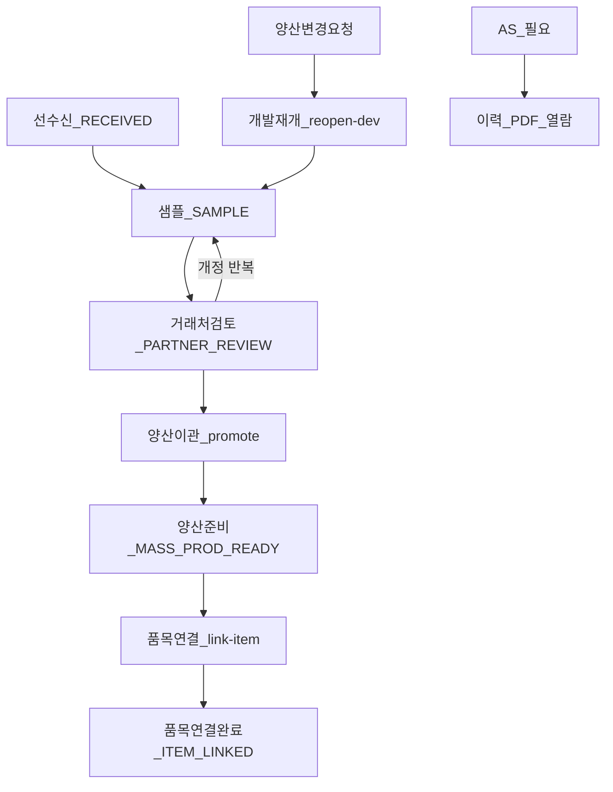

# SmartManager — 도면 lifecycle·업무 절차 설계서

> **문서 버전:** 1.3  
> **작성일:** 2026-07-16  
> **상태:** TO-BE — **Phase 1~3 구현 반영** · 보관·보관 해제(롤백) · 후속 과제 §10 정의  
> **관련:**  
> - Flyway: `V072__drawing.sql` · `V074__drawing_item_link.sql` · `V092__drawing_lifecycle.sql`  
> - 참조 그래프: [`drawing-reference-design.md`](./drawing-reference-design.md)  
> - 감사 컬럼: [master-audit-fields](../../.cursor/rules/master-audit-fields.mdc)

---

## 1. 문서 목적

거래처 도면 **선수신 → 시제품(DEV) 반복 → 양산(PROD) 이관 → 기준정보 품목 수동 연결 → AS 과거 이력 열람** 업무 절차를  
`drawing_master.lifecycle_stage`·서비스 가드·API·UI로 정합한다.

| 구분 | 내용 |
|------|------|
| **대상** | 백엔드(Spring Boot 3.5), DB(Flyway V092), 프론트(React) |
| **범위** | lifecycle stage, 선수신 거래처, 품목 연결 전용 API, reopen-dev, AS 검색 |
| **범위 외 (후속)** | §10 — `drawing_work_log`, 세분 권한 Flyway, BOM 폭발 도면 조회(DR-5) |

### 1.1 확정 원칙

| # | 선택 | 내용 |
|---|------|------|
| **1-A** | 품목 | 기준정보 **수동 등록** 후 `link-item`으로만 연결 |
| **2-C** | 권한 | `basis:drawing:read` / `write` / `hard-delete` 유지. 부서 차이는 **UI 탭·버튼·안내**만 |

---

## 2. 업무 흐름

### 2.1 최초 거래처 도면

1. **등록** — DEV 고정, `source_partner_id` 선택, `item_id` 없음 → `RECEIVED`
2. **개정** — MINOR/MAJOR (`revise`), DEV latest만
3. **단계 변경** — `PUT /lifecycle` (DEV latest, 수동 stage만)
4. **양산 이관** — `POST /{partNo}/promote` → PROD major 증가, `MASS_PROD_READY`
5. **품목 연결** — 기준정보 품목 등록 후 `POST /{id}/link-item` → `ITEM_LINKED`

### 2.2 양산 변경 (V2)

1. PROD latest에서 `POST /{partNo}/reopen-dev` → DEV major = max(PROD major)+1, stage `SAMPLE`
2. 2.1과 동일 루프 후 재승격 → PROD major 증가 (예: V2.0)

### 2.3 AS (애프터서비스)

- 상세 뷰어 **이력 사이드바** + 과거 PDF 워터마크 (기존)
- 목록 **「전체 이력 포함」** 검색 — `GET /drawings?historyQuery=` (개정 사유·버전)
- **업무 단계** 필터 — `GET /drawings?lifecycleStage=ARCHIVED` 등

---

## 3. 데이터 모델

### 3.1 `drawing_master` (V092)

| 컬럼 | 설명 |
|------|------|
| `lifecycle_stage` | `RECEIVED` \| `SAMPLE` \| `PARTNER_REVIEW` \| `MASS_PROD_READY` \| `ITEM_LINKED` \| `ARCHIVED` |
| `source_partner_id` | FK → `company` (선수신 거래처, nullable) |
| `item_id` | FK → `item` (nullable, **link-item 전용**) |
| `item_linked_at` | 품목 연결 시각 |

- stage는 **마스터 단위** 업무 상태 (`drawing_history` 버전과 별개)
- 기존 데이터 백필: `item_id` 있음 → `ITEM_LINKED`, latest PROD → `MASS_PROD_READY`, 그 외 DEV → `SAMPLE`

### 3.2 버전 표기

| DB | 화면 | 의미 |
|----|------|------|
| `major_version=1`, `minor_version=1` | **V1.1** | 구 표기 V1-1 (메이저 1, 마이너 1) |
| `drawing_type=DEV` | 개발품 | 품질·시제품 단계 |
| `drawing_type=PROD` | 양산품 | 생산 열람·품목 연결 대상 |

---

## 4. 서비스 가드 (`DrawingService`)

| 규칙 | 동작 |
|------|------|
| `register` | `item_id` 미수신, 기본 stage `RECEIVED`, `source_partner_id` 검증 |
| `updateInfo` | 품번·품명·기종만, `item_id` 변경 금지 |
| `revise` | latest **PROD** 또는 **ARCHIVED** → 거부 |
| `promote` | DEV latest만, PROD major = max+1, stage → `MASS_PROD_READY`. **ARCHIVED** 거부 |
| `reopen-dev` | PROD latest → DEV major = max(PROD)+1, stage → `SAMPLE`. **ARCHIVED** 거부 |
| `link-item` | latest **PROD** + stage `MASS_PROD_READY` 또는 `ITEM_LINKED`. **ARCHIVED** 거부 |
| `updateLifecycle` | 활성: `ITEM_LINKED`·`MASS_PROD_READY`는 전용 API만. **보관** 수동 가능. **보관 해제** 시 요청 단계와 무관하게 서버가 복귀 단계 확정(PROD→`MASS_PROD_READY`/`ITEM_LINKED`, DEV→`SAMPLE`) |

---

## 5. API

Base: `/api/v1/basis/drawings`

| Method | Endpoint | 설명 |
|--------|----------|------|
| `GET` | `/` | 목록. `?lifecycleStage=` · `?historyQuery=` (AS 이력 검색) |
| `POST` | `/register` | DEV 등록, `sourcePartnerId` |
| `POST` | `/{partNo}/revise` | DEV 개정 |
| `POST` | `/{partNo}/promote` | 양산 이관 |
| `POST` | `/{partNo}/reopen-dev` | 개발 재개 |
| `PUT` | `/{id}/lifecycle` | 업무 단계 수동 변경 |
| `POST` | `/{id}/link-item` | 품목 연결 |
| `PUT` | `/{id}/info` | 메타만 (품목 제외) |

목록 응답 추가 필드: `lifecycleStage`, `sourcePartnerId`, `sourcePartnerName`, `itemLinkedAt`

### 5.1 도메인 이벤트

| EventType | 시점 |
|-----------|------|
| `DrawingRegistered` | 등록 |
| `DrawingRevised` | 개정 |
| `DrawingPromoted` | 양산 이관 |
| `DrawingReopenedDev` | 개발 재개 |
| `DrawingLifecycleUpdated` | stage 변경 |
| `DrawingItemLinked` | 품목 연결 |

---

## 6. UI

| 화면 | 내용 |
|------|------|
| **등록** | 선수신 거래처, DEV 고정, 품목 필드 없음 |
| **목록** | 업무 단계·선수신 거래처 열, AS 이력 검색, 역할별 기본 탭 |
| **상세** | stage 배지·변경(DEV 활성만), **보관** / **보관 해제**, 양산 이관, 개발 재개, 품목 연결 CTA |
| **정보 수정** | 품번·품명·기종만. **ARCHIVED** 시 숨김 |

### 6.2 보관(`ARCHIVED`) 의미

| 구분 | 내용 |
|------|------|
| **양산 보관** | 더 이상 양산·개정에 쓰지 않음. **기출고 AS·재제작 납품**을 위해 PDF·이력 **열람만** 유지 |
| **개발 중단(보관)** | 양산 전 취소·보류. 드롭다운이 아니라 「개발 중단(보관)」 버튼 |
| **보관 중 금지** | 개정·버전업·양산 이관·개발 재개·품목 연결·정보 수정 |
| **허용** | 목록·상세·이력·PDF 열람 (AS 검색 포함) |
| **보관 해제(롤백)** | 「보관 해제」— PROD는 품목 유무에 따라 `ITEM_LINKED` / `MASS_PROD_READY`, DEV는 `SAMPLE` 로 복귀. 이후 정상 업무 재개 |

### 6.1 역할 UI 가이드 (권한 코드 분리 없음)

| 사용자 | UI |
|--------|-----|
| `PRODUCTION_OPERATOR` (read) | 기본 **양산품** 탭, 등록·개정 숨김 |
| `BASIS_MANAGER` / write | 기본 **개발품** 탭, 전체 워크플로 버튼 |
| 안내 | "개발품=품질·관리, 양산품=생산 열람" |

---

## 7. 참조 그래프 연계

- `promote` / `reopen-dev` 시 `drawing_reference` **스냅샷 복사** ([`drawing-reference-design.md` §5](./drawing-reference-design.md))
- PROD 승격 시 자식 pin 전부 PROD 검증 유지
- 상세: [`drawing-reference-design.md`](./drawing-reference-design.md) §5.4·§5.5

---

## 8. 구현 체크리스트

- [x] Flyway V092 `lifecycle_stage` · `source_partner_id` · `item_linked_at`
- [x] `reopen-dev` · `link-item` · `lifecycle` API
- [x] 서비스 가드·단위 테스트 (`DrawingServiceTest`)
- [x] 프론트 워크플로 UI (등록·목록·뷰어·품목 연결)
- [x] AS 이력 검색 (`historyQuery`) · stage 필터
- [x] 본 설계서 작성

---

## 9. 후속 체크리스트 (미착수)

| ID | 항목 | 문서 |
|----|------|------|
| F-1 | `drawing_work_log` | §10.1 |
| F-2 | 세분 권한 Flyway | §10.2 |
| F-3 | BOM 폭발 도면 조회 (DR-5) | §10.3 · [reference §10](./drawing-reference-design.md) |

---

## 10. 후속 과제 (별도 착수용)

Phase 1~3 **범위 외**. 아래 항목은 본 문서·[`drawing-reference-design.md`](./drawing-reference-design.md)에 설계 초안을 두었으며,  
**필요 시 독립 Wave/PR로 진행**한다. (구현 전 해당 절을 SSOT로 삼는다.)

| ID | 과제 | 우선 문서 | Flyway 예상 |
|----|------|-----------|-------------|
| **F-1** | `drawing_work_log` — 시제품 피드백 | 본 절 §10.1 | V093+ |
| **F-2** | 도면 세분 권한 | 본 절 §10.2 | V094+ (permission 시드) |
| **F-3** | BOM 폭발 도면 조회 (DR-5) | [`drawing-reference-design.md` §10](./drawing-reference-design.md) | 스키마 없음 (집계 API) |

### 10.1 F-1 — `drawing_work_log` (시제품 피드백)

**배경**  
`drawing_history.change_reason`만으로는 시제품 제작 결과·거래처 회신·품질 판정 등 **업무 일지**가 부족할 때 보완한다.  
도면 PDF 개정과 **분리**된 텍스트 이력이다.

**트리거**  
`lifecycle_stage`가 `SAMPLE` 또는 `PARTNER_REVIEW`일 때 뷰어·목록에서 「업무 일지」탭 노출.

**스키마 초안** (`drawing_work_log`)

| 컬럼 | 설명 |
|------|------|
| `id` | UUID PK |
| `drawing_master_id` | FK → `drawing_master` |
| `drawing_history_id` | FK → `drawing_history` (nullable — 마스터 단위 메모 시 null) |
| `log_type` | `SAMPLE_RESULT` \| `PARTNER_FEEDBACK` \| `INTERNAL_NOTE` \| `APPROVAL` |
| `summary` | VARCHAR(200) 요약 |
| `body` | TEXT 상세 |
| `occurred_at` | DATETIME(3) 현장 일자 |
| `recording_state` | 1/0 소프트 삭제 |
| 감사 컬럼 | [master-audit-fields](../../.cursor/rules/master-audit-fields.mdc) 패턴 |

**API (제안)**

| Method | Endpoint | 설명 |
|--------|----------|------|
| `GET` | `/{masterId}/work-logs` | 목록 (최신순) |
| `POST` | `/{masterId}/work-logs` | 등록 (`write`) |
| `PUT` | `/{masterId}/work-logs/{logId}` | 수정 |
| `DELETE` | `/{masterId}/work-logs/{logId}` | 소프트 삭제 |

**이벤트**  
`DrawingWorkLogRegistered` / `DrawingWorkLogUpdated` / `DrawingWorkLogDeleted` (선택).

**UI**  
`DrawingViewerModal` 탭 「업무 일지」— 타임라인 + 등록 폼. 개정 사유와 병기 표시만, PDF 교체는 `revise` 유지.

**완료 기준**  
시제품 1건에 피드백 2건 이상 기록·조회 가능. AS 검색(`historyQuery`)과 **독립** (필요 시 `work_log` 본문 검색은 F-1-b로 후속).

---

### 10.2 F-2 — 도면 세분 권한 (Flyway)

**배경**  
Phase 1~3는 **2-C 확정**: `basis:drawing:read` / `write` / `hard-delete` + UI 가이드만.  
현장에서 **API 단위 차단**이 필요해지면 본 절대로 Flyway 시드·`@BasisAuthorize` 확장.

**제안 permission**

| 코드 | 용도 | 대상 역할(예) |
|------|------|----------------|
| `basis:drawing:read` | 조회 (기존) | 전원 |
| `basis:drawing:write` | 등록·개정·삭제 (기존) | BASIS_MANAGER |
| `basis:drawing:dev-write` | DEV 등록·개정·lifecycle·promote·reopen-dev | 품질·관리 |
| `basis:drawing:prod-read` | PROD PDF·목록 양산 탭 (명시적, 선택) | 생산 |
| `basis:drawing:hard-delete` | 휴지통 영구 삭제 (기존) | SYSTEM_ADMIN |

**적용 규칙**

- `dev-write` 없이 `write`만 있으면 **현행과 동일** (하위 호환).
- `DrawingService` lifecycle 가드는 **유지** — 권한은 “누가 API를 호출할 수 있는지”, 가드는 “업무상 허용 여부”.
- UI: `dev-write` 없으면 등록·개정 버튼 숨김 (현 `readOnly`와 병행).

**Flyway 작업**

1. `permission` INSERT  
2. `role_permission` — `BASIS_MANAGER`→`dev-write`, `PRODUCTION_OPERATOR`→`prod-read` 등  
3. `BasisAuthorize` 어노테이션·`DrawingController` 메서드 매핑 표 갱신

**완료 기준**  
생산 계정으로 `POST /register` → 403, `GET /pdf/{partNo}` (PROD) → 200.

---

### 10.3 F-3 — BOM 폭발 도면 조회 (DR-5)

**소속 문서**  
[`drawing-reference-design.md` §10](./drawing-reference-design.md) — `drawing_reference`(출도 pin)와 **별개** 보조 UX.

**요약**  
모품목 `item_no` → `ItemCompositionService.explode` → 하위 `item_id`별 **latest 활성 도면** 목록·PDF 링크.  
이미 뷰어 「구성 참조」의 BOM 후보(`reference-candidates`)와 코드 재사용 가능.

**착수 조건**  
- F-3-a: 집계 API + 품목 화면/도면 화면 「BOM 하위 도면」모달  
- F-3-b: `drawing_reference` vs BOM **diff 리포트** (선택)

상세 API·응답·UI는 reference 설계 §10을 따른다.

---

## 11. 변경 이력

| 버전 | 일자 | 내용 |
|------|------|------|
| 1.0 | 2026-07-16 | Phase 1~3 구현 반영 — lifecycle·가드·UI·AS 검색·문서 초판 |
| 1.1 | 2026-07-16 | §10 후속 과제 F-1~F-3 (work_log·세분 권한·DR-5) 착수용 설계 |
| 1.2 | 2026-07-16 | 양산·개발 보관 UX, ARCHIVED 시 개정·버전업 금지, 품목연결 z-index |
| 1.3 | 2026-07-16 | 보관 해제(롤백) — PROD/DEV 복귀 단계·UI |

---

*구현 SSOT. [`drawing-reference-design.md`](./drawing-reference-design.md)와 함께 유지보수한다.*
