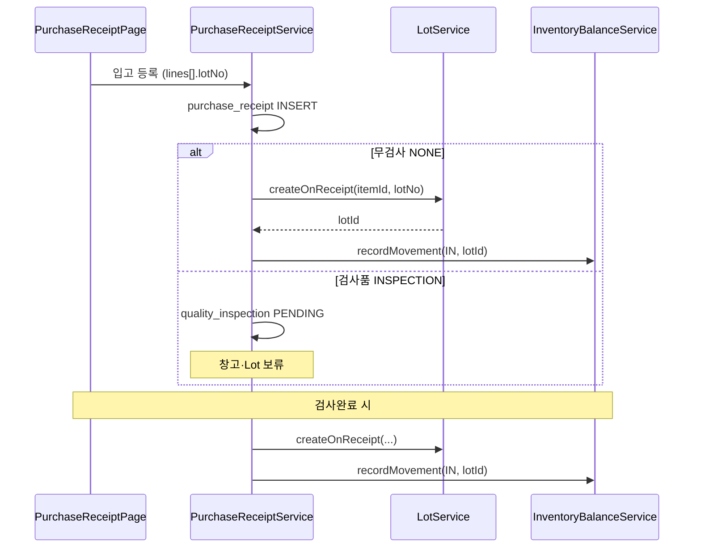
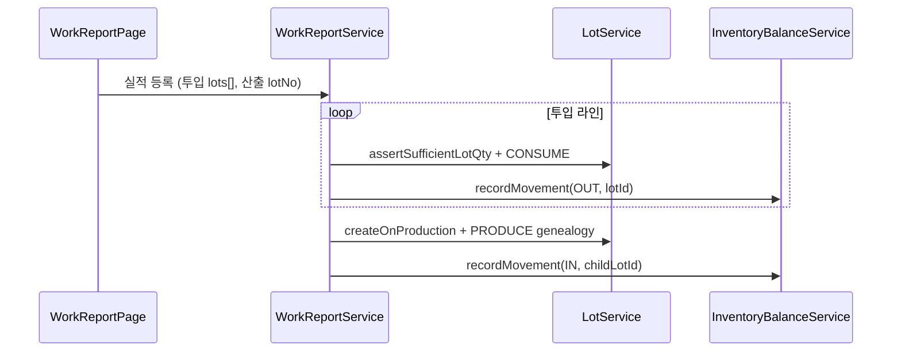

# SmartManager — LOT 연동 설계서

> **문서 버전:** 1.0  
> **작성일:** 2026-07-10  
> **상태:** TO-BE 확정 초안 — **미구현**  
> **관련 문서:**  
> - [D5 Lot 추적 개요](./d5-lot-traceability.md)  
> - [재고·원장 SSOT](../../results/sample/inventory-ledger-spec.md)  
> - [TX 취소·삭제 정책](./tx-cancel-delete-policy.md)  
> - [Domain Event · Projector 매핑](./domain-event-projector-matrix.md)  
> - 스키마 초안 [`schema-drafts/V007__lot_traceability.sql`](./schema-drafts/V007__lot_traceability.sql)  
> - 레거시 스키마 [`results/mariadb_schema.sql`](../../results/mariadb_schema.sql) (`LotLedger`, `LotNum` 컬럼)

---

## 1. 문서 목적

본 문서는 **현재 SmartManager 프로젝트**(슬롯 집계 재고 운영 중)에 **LOT(배치) 추적**을 어떻게 연결할지 정의한다.

| 구분 | 내용 |
|------|------|
| **대상** | 백엔드(Spring Boot 3.5), DB(Flyway), 프론트엔드(React) |
| **범위** | 데이터 모델, 재고 진입점 확장, TX별 Lot 생성·이동·소비, API·화면, 마이그레이션 Wave |
| **범위 외** | 유효기간·시험성적서 UI, Lot 분할·병합 화면, 글로벌 Lot 번호 체계 |

---

## 2. 현재 상태 (AS-IS)

### 2.1 구현된 것

SmartManager는 **품목 × 창고 슬롯 × 수량** 단위 재고를 운영한다.

```text
inventory_location (RAW, SALES, DELIVERY, WIP, OUTSOURCE)
        ↓
inventory_balance          ← 슬롯 현재고 (UK: item×location×연도×공정×거래처)
        ↓
stock_movement (V028)      ← append-only 입출고 원장
inventory_balance_monthly  ← 슬롯별 월별 입·출·잔
```

- **단일 진입점:** `InventoryBalanceService.recordMovement(RecordStockMovementCommand)`
- **모든 TX 재고 반영:** `*InventoryService`가 위 메서드를 동기 호출
- **취소 정책:** 역방향 `stock_movement` INSERT + `*_CANCEL` reference_type ([tx-cancel-delete-policy](./tx-cancel-delete-policy.md))

### 2.2 없는 것 (Gap)

| 항목 | 상태 |
|------|------|
| `item.lot_tracked` | ❌ |
| `inventory_lot`, `inventory_lot_balance`, `lot_genealogy` | ❌ |
| `stock_movement.lot_id` | ❌ |
| Lot CRUD API / Lot 조회 화면 | ❌ |
| 구매입고·작업실적·출고 DTO의 `lotNo` | ❌ |
| 레거시 `LotLedger` ETL | ❌ |

**결론:** 현재는 **집계 재고만 추적** 가능하며, 동일 품목 내 **배치별 역추적·정추적은 불가**하다.

### 2.3 기타구매입고

`EtcPurchaseReceiptService`는 **재고·Lot 반영 대상이 아니다** (매입·미지급 원장만). 본 설계의 LOT Wave에 포함하지 않는다.

---

## 3. 연동 목표 (TO-BE)

### 3.1 비즈니스 목표

1. **선택적 Lot 추적** — 품목별 `lot_tracked = true`일 때만 Lot 필수
2. **입고 시 Lot 식별** — 구매입고·외주입고·생산 산출 시 Lot 생성 또는 지정
3. **출고·투입 시 Lot 지정** — 작업실적 투입, 외주출고, 영업출고에서 소비 Lot 선택
4. **양방향 계보** — 원자재 Lot → 공정 투입 → 완제품 Lot (`lot_genealogy`)
5. **감사 가능** — Lot 이동은 `stock_movement`에 남기고 물리 DELETE 금지

### 3.2 레거시 대응

| 레거시 | SmartManager TO-BE |
|--------|-------------------|
| `LotLedger` (Lot 마스터 화면) | `inventory_lot` + 관리 API |
| `BD_HT`, `SH_HT` 등의 `LotNum` | TX 시점 `inventory_lot` 생성 + `stock_movement.lot_id` |
| `LotNumberManagement.aspx` | 품목 화면 `lot_tracked` + (선택) Lot 수동 등록 API |

레거시 `LotLedger`는 입출고 이력과 FK가 없었다. SmartManager는 **TX와 Lot를 1:1로 묶어** 추적성을 확보한다.

---

## 4. 핵심 설계 원칙

### 4.1 두 계층 분리

```text
┌──────────────────────────────────────────────────────────────┐
│  슬롯 집계 (기존)                                              │
│  inventory_balance + inventory_balance_monthly                 │
│  → 품목×창고×공정×거래처 합계 (Lot 무관)                        │
└──────────────────────────────────────────────────────────────┘
                              ↑
                    SUM(lot_balance) ≈ 슬롯 검증
                              ↑
┌──────────────────────────────────────────────────────────────┐
│  Lot 계층 (신규)                                               │
│  inventory_lot → inventory_lot_balance → stock_movement.lot_id │
│  lot_genealogy (부모↔자식)                                     │
└──────────────────────────────────────────────────────────────┘
```

- **Projector(기준정보)** 는 슬롯만 만든다 (`WipBalanceProjector`, `OutsourceInputBalanceProjector`).
- **Lot 생성·이동은 TX 전용**이다. Projector가 Lot를 만들지 않는다.

### 4.2 단일 진입점 유지

현재 코드베이스는 TX 재고를 **동기 `*InventoryService` → `recordMovement`** 로 처리한다.  
Lot 연동도 **동일 패턴**을 따른다. (D5 초안의 `InventoryOn*Listener`는 채택하지 않음)

```text
TX Service
  → *InventoryService (기존)
      → LotInventoryService.applyLotMovement()  ← 신규 (lot_tracked 검증·잔량)
      → InventoryBalanceService.recordMovement() ← 기존 (슬롯 집계)
```

이벤트 기반 비동기 Listener는 Wave 2 이후 리플레이·대량 재계산 시에만 검토한다.

### 4.3 취소·역전

- Lot 잔량도 **append-only** — 취소 TX는 반대 방향 `stock_movement` + `inventory_lot_balance` 감산
- Lot 상태 `DEPLETED` 복구: 취소 시 `ACTIVE`로 되돌림 (잔량 > 0일 때)
- [tx-cancel-delete-policy](./tx-cancel-delete-policy.md)와 동일: `stock_movement` 물리 DELETE 금지

---

## 5. 데이터 모델

### 5.1 신규·변경 테이블

> **주의:** `schema-drafts/V007`은 `stock_movement` 전체 CREATE 스케치이다.  
> **실제 적용 시 V028이 이미 존재**하므로 아래처럼 **ALTER + 신규 테이블**로 분리한다.

#### (1) `item` — Lot 추적 플래그

```sql
ALTER TABLE item
  ADD COLUMN lot_tracked TINYINT(1) NOT NULL DEFAULT 0
    COMMENT '1=입출고 시 lot_id 필수';
```

#### (2) `inventory_lot` — Lot 마스터

| 컬럼 | 설명 |
|------|------|
| `item_id`, `lot_no` | UK `(item_id, lot_no, recording_state)` — **품목 내 유일** |
| `status` | `ACTIVE` \| `BLOCKED` \| `DEPLETED` |
| `origin_type` | `PURCHASE`, `PRODUCTION`, `MANUAL`, `SPLIT`, `MERGE`, `ADJUSTMENT` |
| `origin_doc_type`, `origin_doc_id` | 최초 생성 TX 참조 |
| `expiry_date`, `certificate_ref` | v1.0 컬럼만, UI 후순위 |

#### (3) `inventory_lot_balance` — Lot × 슬롯 현재고

| UK | `(lot_id, inventory_balance_id, recording_state)` |
|----|---------------------------------------------------|
| `qty_on_hand` | Lot별 슬롯 잔량 (음수 금지) |

#### (4) `lot_genealogy` — 계보

| `link_type` | 용도 |
|-------------|------|
| `CONSUME` | 작업실적 투입 — 부모 Lot 소비 |
| `PRODUCE` | 작업실적 산출 — 자식 Lot 생성 |
| `SPLIT` / `MERGE` | Wave 2+ |

#### (5) `stock_movement` — 컬럼 추가 (V028 확장)

```sql
ALTER TABLE stock_movement
  ADD COLUMN lot_id BIGINT NULL COMMENT 'lot_tracked 품목은 NOT NULL',
  ADD INDEX idx_stock_movement_lot (lot_id, movement_date, recording_state),
  ADD CONSTRAINT fk_stock_movement_lot
    FOREIGN KEY (lot_id) REFERENCES inventory_lot (id);
```

#### (6) `lot_number_sequence` — 자동 번호 (Wave 2, 선택)

`{item_no}-{yyyyMMdd}-{seq}` 규칙용.

### 5.2 정합성 규칙 (애플리케이션)

```text
∀ 슬롯 B:
  SUM(inventory_lot_balance.qty_on_hand WHERE balance_id = B)
    = inventory_balance.stock_qty        (현재고)
    ≈ inventory_balance_monthly.stock_qty  (해당 월)

∀ lot_tracked 품목의 movement M:
  M.lot_id IS NOT NULL

∀ non-lot_tracked 품목:
  M.lot_id IS NULL
  inventory_lot_balance 행 없음
```

일일 배치 또는 TX 종료 시 슬롯·Lot 합계 불일치를 로깅한다 (v1.0: 예외 throw, v1.1: 관리 화면).

---

## 6. 애플리케이션 아키텍처

### 6.1 신규 컴포넌트

| 컴포넌트 | 패키지 | 역할 |
|----------|--------|------|
| `LotService` | `application.inventory` | Lot CRUD, 번호 중복 검증, 자동 채번 |
| `LotInventoryService` | `application.inventory` | `inventory_lot_balance` 갱신, OUT 시 잔량 검증 |
| `LotRepository` | `application.inventory` | JPA 인프라 |
| `RecordStockMovementCommand` | 기존 확장 | `Long lotId` (nullable) 추가 |
| `InventoryBalanceService` | 기존 확장 | `lot_tracked`이면 `LotInventoryService` 선행 호출 |

### 6.2 `RecordStockMovementCommand` 확장

```java
public record RecordStockMovementCommand(
        long itemId,
        String locationCode,
        LocalDate movementDate,
        StockMovementType movementType,
        BigDecimal qty,
        BigDecimal amount,
        String referenceType,
        long referenceId,
        Long outputProcessId,
        Long inputProcessId,
        Long partnerId,
        Long lotId,           // 신규 — lot_tracked 품목 필수
        String actorUserId
) { ... }
```

### 6.3 `LotService` 주요 API (애플리케이션)

| 메서드 | 설명 |
|--------|------|
| `createOnReceipt(itemId, lotNo, originType, docType, docId)` | 구매·외주 입고 시 Lot 생성 |
| `createOnProduction(itemId, lotNo, parentLotIds, qty)` | 작업실적 산출 Lot + genealogy |
| `resolveOrCreate(itemId, lotNo, autoGenerate)` | 수동 입력 또는 자동 채번 |
| `assertSufficientLotQty(lotId, balanceId, qty)` | 출고·투입 전 검증 |
| `findAvailableLots(itemId, locationCode, processId)` | 출고 화면 Lot 선택 목록 |

### 6.4 REST API (신규)

Base: `/api/v1/inventory/lots`

| Method | Endpoint | 권한 | 설명 |
|--------|----------|------|------|
| `GET` | `/` | `inventory:read` | 품목·창고·상태 필터 |
| `GET` | `/{id}` | `inventory:read` | 상세 + 슬롯별 잔량 |
| `GET` | `/{id}/genealogy` | `inventory:read` | `direction=UP\|DOWN` 계보 |
| `GET` | `/{id}/movements` | `inventory:read` | `stock_movement` 페이지 |
| `POST` | `/` | `inventory:write` | 수동 Lot 등록 (관리자) |

기존 TX API는 라인 DTO에 아래 필드를 **선택 추가**한다.

```typescript
type LotLineInput = {
  lotNo?: string;           // 수동
  autoGenerateLot?: boolean; // 자동 채번
  lotId?: number;           // 출고·투입 시 기존 Lot 지정
};
```

---

## 7. 트랜잭션별 LOT 연동

### 7.1 연동 맵 (전체)

| # | 화면 | TX | Inventory Service | Lot 동작 | Wave |
|---|------|-----|-------------------|----------|------|
| 1 | 구매입고 | `PurchaseReceiptService` | `PurchaseReceiptService` 내 직접 | 입고 시 Lot **생성** + RAW IN | LOT-2 |
| 2 | 품질검사 | `QualityInspectionService` | 동일 | 검사품: 합격 시 Lot 생성·IN (입고 시 미생성이면) | LOT-2 |
| 3 | 자재투입 | `MaterialIssueInventoryService` | RAW OUT | 투입 Lot **소비** | LOT-3 |
| 4 | 작업실적 | `WorkReportInventoryService` | WIP/SALES 이동 | 산출 Lot **생성** + PRODUCE genealogy | LOT-3 |
| 5 | 작업실적 투입 | `WorkReportConsumptionInventoryService` | RAW/WIP OUT | 투입 Lot CONSUME + genealogy | LOT-3 |
| 6 | 외주출고 | `OutsourcingShipmentInventoryService` | OUTSOURCE/WIP | Lot **이동** (슬롯 간) | LOT-4 |
| 7 | 외주입고 | `OutsourcingReceiptInventoryService` | WIP IN | Lot 생성 또는 기존 Lot 입고 | LOT-4 |
| 8 | 영업출고 | `SalesShipmentInventoryService` | SALES OUT + DELIVERY IN | Lot **소비**, 잔량 0 → `DEPLETED` | LOT-4 |
| 9 | 매출인식 | `SalesRevenueInventoryService` | DELIVERY OUT | Lot 소비 (출고 Lot와 동일) | LOT-4 |
| 10 | 기타입출고 | `MiscStockMovementInventoryService` | IN/OUT | Lot 수동 지정 (관리자) | LOT-4 |
| — | 기타구매입고 | `EtcPurchaseReceiptService` | **없음** | **미적용** | — |

### 7.2 구매입고 (LOT-2) — 시퀀스



**UI 변경 (`PurchaseReceiptPage`):**
- `lot_tracked` 품목 라인에 `Lot 번호` 입력 또는 `자동생성` 체크
- 무검사: 입고 등록 시 필수
- 검사품: 검사완료 화면에서 Lot 입력 (또는 입고 시 예약 번호)

### 7.3 작업실적 (LOT-3) — 시퀀스



**UI 변경 (`WorkReportPage`):**
- 투입 탭: `lot_tracked` 자재에 **보유 Lot 목록** 드롭다운 (창고·공정 필터)
- 산출 탭: 완제품 `lot_tracked`이면 산출 Lot 번호 입력/자동

### 7.4 영업출고 (LOT-4)

- `SalesShipmentPage`: 출고 라인별 Lot 선택 (FIFO 기본 정렬 옵션 — v1.1)
- 출고 수량 = 선택 Lot 잔량 이하 검증
- 전량 출고 시 `inventory_lot.status = DEPLETED`

### 7.5 취소 TX

각 `*InventoryService`의 cancel 메서드에서:
1. 원본 `stock_movement`의 `lot_id` 조회
2. 역방향 movement INSERT (`reference_type = *_CANCEL`)
3. `inventory_lot_balance` 역갱신
4. genealogy 역링크는 v1.0에서 **소프트 무효화** (`recording_state = 0`) — 물리 DELETE 금지

---

## 8. 화면·API 변경 요약

| 화면 | 변경 |
|------|------|
| **품목** (`ItemPage`) | `Lot 추적` 체크박스 (`lot_tracked`) |
| **재고·원장** (`InventoryLedgerPage`) | 탭 추가: **Lot 잔량** / Lot 이력 drill-down |
| **구매입고** | 라인별 Lot 입력 |
| **품질검사** | 검사완료 시 Lot (검사품) |
| **작업실적** | 투입 Lot 선택, 산출 Lot 생성 |
| **외주출고·입고** | Lot 이동·생성 |
| **영업출고** | Lot 선택 출고 |
| **기타입출고** | Lot 수동 지정 (선택) |

---

## 9. Flyway 마이그레이션 전략

| 버전 | 내용 | 비고 |
|------|------|------|
| **V070** | `item.lot_tracked`, `inventory_lot`, `inventory_lot_balance`, `lot_number_sequence` | Lot 기반 |
| **V071** | `stock_movement.lot_id` FK, `lot_genealogy` | V028 위 ALTER |
| **V072** | Lot 조회용 인덱스·권한 시드 (`inventory:lot:read` 등) | 선택 |

`schema-drafts/V007` 전체를 그대로 적용하지 않는다. V028 `stock_movement` 스키마(`movement_type`, `reference_type`, `fiscal_month` 등)를 유지한다.

---

## 10. 구현 Wave

```text
LOT-0  문서 확정 (본 문서 + d5)
  ↓
LOT-1  Flyway V070–V071 · LotService · Lot CRUD API · 품목 lot_tracked UI
  ↓
LOT-2  구매입고 + 품질검사 Lot 생성·RAW 입고
  ↓
LOT-3  작업실적 투입/산출 + lot_genealogy
  ↓
LOT-4  외주·영업·기타입출고 Lot 이동·소비
  ↓
LOT-5  레거시 LotLedger·LotNum ETL · 재고 원장 Lot 탭
```

### 선행 조건 (이미 충족)

- [x] `stock_movement` / `inventory_balance_monthly` (V028)
- [x] 구매입고·작업실적·출고 TX + `*InventoryService`
- [x] `InventoryBalanceService` 단일 진입점

### Wave별 완료 기준

| Wave | 완료 기준 |
|------|-----------|
| LOT-1 | Lot 수동 등록 API, 품목 `lot_tracked` 저장, 빈 DB 마이그레이션 성공 |
| LOT-2 | 무검사 구매입고 E2E: Lot 생성 → RAW 잔량 → 원장 조회 |
| LOT-3 | 작업실적 1건: 투입 Lot 소비 + 산출 Lot 생성 + genealogy 조회 API |
| LOT-4 | 영업출고 1건: Lot 선택 → DEPLETED |
| LOT-5 | 레거시 `LotLedger` 100건 이상 ETL 검증 리포트 |

---

## 11. 레거시 ETL (LOT-5)

| 레거시 | TO-BE |
|--------|-------|
| `LotLedger` | `inventory_lot` (`origin_type = MANUAL`) |
| `BD_HT.LotNum` 등 TX | `inventory_lot` + `stock_movement` 소급 (가능한 경우) |
| `LotLedger.P1`, `P2` | `inventory_lot.p1`, `p2` (번호 규칙 placeholder) |

ETL 시 `lot_tracked` 기본값:
- 원자재·상품: `1` (정책 확정 후 조정)
- 공정품·제품: BOM·공정 정책에 따라 개별 매핑

---

## 12. Lot 번호 정책 (v1.0)

| 방식 | 규칙 | 적용 |
|------|------|------|
| **수동** | 사용자 입력, 품목 내 UK 검증 | LOT-2 |
| **자동** | `{item_no}-{yyyyMMdd}-{seq:3}` | LOT-3+ (`lot_number_sequence`) |

레거시 `P1`/`P2`는 자동 규칙 확장용으로 컬럼만 보존한다.

---

## 13. 미결정 · v1.1 검토

| # | 항목 | v1.0 가정 |
|---|------|-----------|
| 1 | 출고 Lot 선택 기본 정렬 | 수동 선택만 (FIFO 자동 배정 없음) |
| 2 | 동일 Lot의 다중 슬롯 보유 | 허용 (`inventory_lot_balance` 복수 행) |
| 3 | Lot 병합·분할 UI | API·genealogy만, 화면 없음 |
| 4 | 품질검사 불합격 Lot | `BLOCKED` 상태, 창고 미반영 |
| 5 | 기타구매입고 Lot | 미적용 (재고 없음) |
| 6 | 이벤트 Listener 전환 | 하지 않음 — 동기 InventoryService 유지 |

---

## 14. 체크리스트 (구현 시)

- [ ] Flyway V070–V071 적용
- [ ] `RecordStockMovementCommand.lotId` + `LotInventoryService`
- [ ] `item.lot_tracked` API·UI
- [ ] `/api/v1/inventory/lots` CRUD·조회
- [ ] `PurchaseReceiptService` Lot 연동
- [ ] `WorkReport*InventoryService` + genealogy
- [ ] `SalesShipmentInventoryService` Lot 소비
- [ ] `domain-event-projector-matrix.md` § Lot 절 추가
- [ ] `inventory-ledger-spec.md` § `lot_id` 반영
- [ ] 통합 테스트: 입고 → 투입 → 산출 → 출고 E2E

---

## 15. 참고 — 왜 Event Listener가 아닌가

D5 초안은 `PurchaseReceiptPosted` 등 **도메인 이벤트 Listener**를 제안했으나, 현재 SmartManager TX는:

1. 같은 `@Transactional` 내에서 `*InventoryService`가 **동기** 호출된다.
2. `PurchaseReceiptPosted` 같은 이벤트 타입이 **아직 정의·발행되지 않았다**.
3. Lot 검증 실패 시 TX 전체 롤백이 필요하다.

따라서 v1.0은 **기존 InventoryService 확장**이 일관되고 구현 비용이 낮다.  
이벤트 발행은 Lot 연동 **이후** 감사·외부 연동 목적으로 추가할 수 있다.

---

*v1.0 · Git commit은 사용자 요청 시*
