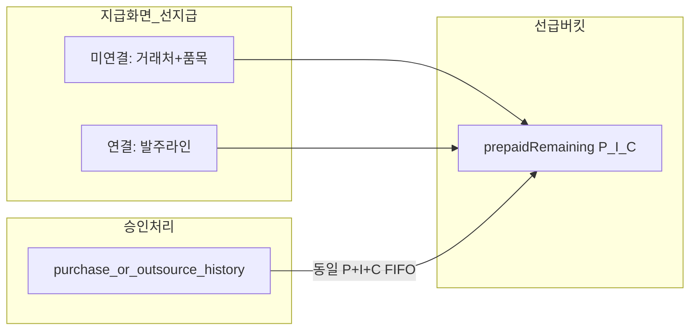
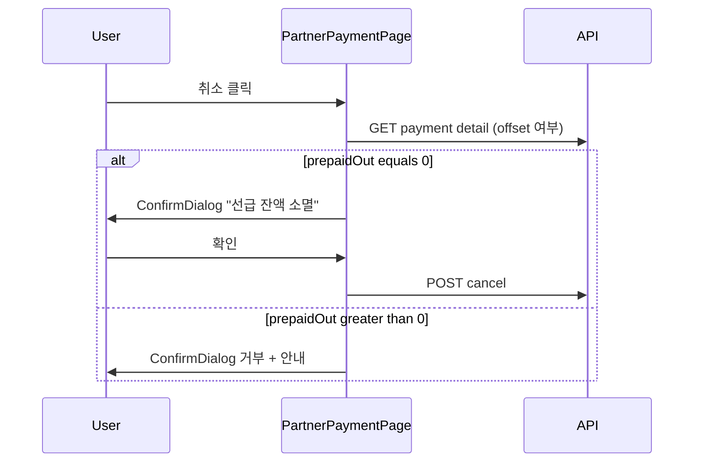
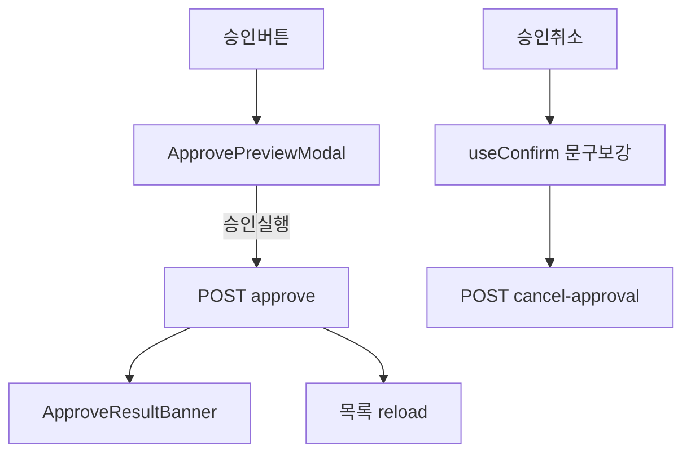

# 품목 단위 선지급 · 승인 FIFO 상계 설계서 (TX1-PP)

> **문서 버전:** 2.2  
> **작성일:** 2026-07-16 · **개정:** 2026-07-19  
> **상태:** 구현  
> **대상:** 구매 지급 · 외주 지급 · 승인처리 · **매입일보 · 월별 실지급액**  
> **관련 문서:** [입고 지급 승인처리 설계서](./payable-approval-design.md)  
> **변경:** v1.0(거래처+비용구분 FIFO) 폐기 → **거래처+품목+비용구분** 선급 버킷 및 FIFO 상계 · v2.1 UI 와이어프레임·컴포넌트 분리 추가 · 구현 반영 (V093) · **v2.2 매입일보 선급상계·월별 실지급액 리포트**

---

## 1. 목적·범위

### 1.1 목적

거래처에 **납품 예정 품목**을 지정해 선지급하고, 이후 그 거래처·그 품목의 **승인처리(지급 확정)** 금액에서 **FIFO로 자동 상계**한다.

현재 [`PartnerPaymentService`](../../smartmanager_backend/smartmanager-application/src/main/java/com/shindong/smartmanager/application/purchase/PartnerPaymentService.java)는 미지급 초과 지급을 거부하고, 지급에 품목 FK가 없다. 본 설계는 품목 단위 선급을 도입한다.

### 1.2 범위

| 포함 | 제외 |
|------|------|
| 미연결 선지급 (거래처 + 품목) | 판매 선수금 |
| 발주라인 연결 선지급 (한도·추적) | 입고·품질검사 화면 로직 변경 |
| 승인 시 동일 거래처·품목·구분 FIFO 상계 | `partner_ledger_monthly`에 prepaid 컬럼 신설 |
| 일반지급(거래처 단위 미지급 정리) 유지 | 발주라인만의 상계 키(상계는 품목 버킷) |

### 1.3 확정 결정

1. **잔액 단위:** 거래처 `P` + 품목 `I` + 비용구분 `C` (`PURCHASE` / `OUTSOURCE`)
2. **등록:** 발주 없이 가능 + 발주라인 연결 **둘 다 지원**
3. **상계 키:** 동일 `(P, I, C)` 승인분만. 발주 FK는 등록 한도·추적용이며 상계 키가 아님
4. **승인 UX:** 승인 전 preview 확인창 + 성공 메시지에 품목별 상계 결과
5. **원장:** `purchase_amount` / `paid_amount` 유지. 선급 소진은 `partner_prepaid_offset`으로 추적

---

## 2. 용어

| 용어 | 의미 |
|------|------|
| 일반지급 (`NORMAL`) | 거래처 단위 미지급 정리. 품목 라인 불필요 |
| 선지급 (`PREPAID`) | 특정 품목(들)에 대한 선수금. 지급 라인에 `item_id` 필수 |
| 미연결 선지급 | 발주라인 FK 없이 거래처+품목+금액으로 등록 |
| 발주라인 연결 선지급 | 구매/외주 발주 라인에 연결. 잔여금액 한도. 상계 풀은 품목 버킷 |
| 품목 선급 잔액 | `prepaidRemaining(P,I,C)` |
| 상계 (offset) | 승인액에서 품목 선급을 FIFO로 소진. 별도 현금 분개 없음 |

---

## 3. 업무 모델



| 등록 유형 | 입력 | 버킷 적립 | 이후 상계 |
|-----------|------|-----------|-----------|
| 미연결 | 거래처, 품목, 비용구분, 금액 | `(P,I,C)` | 동일 `(P,I,C)` 승인 FIFO |
| 발주라인 연결 | 발주라인 선택 → P·I·C 자동, 금액 ≤ 잔여 | 동일 `(P,I,C)` | **동일 품목 버킷 FIFO** (타 발주 동일 품목 승인에도 사용) |

구매 선급은 외주 승인에, 외주 선급은 구매 승인에 **쓰지 않는다**.

---

## 4. 잔액·상계 공식

### 4.1 품목 선급 버킷

```
prepaidIn(P,I,C)  = SUM(partner_payment_line.total_amount)
                    WHERE payment ISSUED, payment_kind=PREPAID, cost_category=C, item_id=I, partner=P
prepaidOut(P,I,C) = SUM(partner_prepaid_offset.amount) for those lines (active)
prepaidRemaining  = prepaidIn − prepaidOut
```

**FIFO 소진 순서:** 동일 버킷 내 `payment_date` → `payment_no` → `payment_line.id` 오름차순.

### 4.2 승인 시 (이력 1건, 승인액 A)

이력의 `company_id`=P, `item_id`=I, 구분이 C일 때:

```
offset = min(A, prepaidRemaining(P,I,C))
→ partner_prepaid_offset 에 FIFO로 분할 기록
원장: addPurchaseAmount(A)만 수행
      (선지급 등록 시 이미 addPaidAmount 됨)
신규미지급 증가 = A − offset
잔여선급 = prepaidRemaining − offset
```

일괄 승인: 선택 순서로 이력을 처리하며, 같은 `(P,I,C)` 버킷 잔액을 순차 소진.

### 4.3 거래처 미지급 (일반지급 한도) — 선급 왜곡 보정

품목 A에만 선지급한 뒤 품목 B가 승인되면, 단순 `approved − paid`는 B 미지급을 숨긴다.

```
unpaidPartner = max(0, approvedPayable − claims − paidTotal + sum(all prepaidRemaining))
```

- `approvedPayable` / `claims` / `paidTotal`: 거래처 단위(현행 집계와 동일 계열)
- `sum(prepaidRemaining)`: 아직 상계되지 않은 **전 품목 선급 합**을 미지급에 다시 더함

### 4.4 금액 단위

이력 `amount` ↔ 지급/라인 `total_amount`(공급가+부가세). 현행 지급과 동일.

---

## 5. 데이터 모델

현행 [`V060__partner_payment.sql`](../../smartmanager_backend/smartmanager-infrastructure/src/main/resources/db/migration/V060__partner_payment.sql) 확장.

### 5.1 `partner_payment`

| 컬럼 | 설명 |
|------|------|
| `payment_kind` | `ENUM('NORMAL','PREPAID') NOT NULL DEFAULT 'NORMAL'` |

기존 행은 `NORMAL` 백필.

### 5.2 `partner_payment_line` (신규)

선지급 시 **1행 이상 필수**. 일반지급은 라인 없음.

| 컬럼 | 설명 |
|------|------|
| `id` | PK |
| `payment_id` | FK → partner_payment |
| `item_id` | FK → item, 필수 |
| `purchase_order_line_id` | NULL, 구매 발주라인 |
| `outsourcing_order_line_id` | NULL, 외주 발주라인 |
| `supply_amount`, `vat_amount`, `total_amount` | 라인 금액 |
| 감사 컬럼 | `recording_state`, created/updated |

제약:

- `purchase_order_line_id`와 `outsourcing_order_line_id`는 **동시에 값 불가** (둘 다 NULL은 미연결)
- 헤더 `cost_category`와 발주 유형 일치 (PURCHASE ↔ 구매라인, OUTSOURCE ↔ 외주라인)
- 라인 `total` 합 = 헤더 `total_amount`

### 5.3 `partner_prepaid_offset` (신규)

| 컬럼 | 설명 |
|------|------|
| `id` | PK |
| `payment_line_id` | FK → partner_payment_line |
| `ledger_kind` | `PURCHASE_HISTORY` / `OUTSOURCE_HISTORY` |
| `history_id` | 승인된 이력 ID |
| `amount` | 상계액 |
| `recording_state` | 활성/비활성 (승인취소 시 0) |
| 감사 컬럼 | |

승인 시 INSERT, 승인취소 시 해당 history의 offset을 `recording_state=0` (또는 삭제)하여 선급 복원.

### 5.4 원장

`partner_ledger_monthly.purchase_amount` / `paid_amount` **컬럼 추가 없음**.

---

## 6. 화면별 UX

### 6.1 구매 > 지급 (`PartnerPaymentPage`)

#### 등록 모드

| 모드 | kind | 품목 | 한도 |
|------|------|------|------|
| 일반지급 | NORMAL | 없음 | `total ≤ unpaidPartner` (보정식) |
| 선지급 | PREPAID | 1개 이상 라인 | 미연결: 양수+마감 / 연결: 라인별 ≤ 발주잔여금액 |

#### 선지급 폼

1. 비용구분 (`PURCHASE` / `OUTSOURCE`)
2. 거래처
3. 품목 라인 표:
   - 품목 검색
   - (선택) **발주라인 연결** — 확정·미취소 발주 라인 검색 → 거래처·품목 고정, 잔여금액 표시·한도
   - 공급가·부가세·총액
4. 한 지급번호에 복수 품목 라인 허용

#### 잔액 표시

- 거래처 미지급 (`unpaidPartner` 보정식)
- **품목별 선급 잔액** 목록: 품목번호·명·구분·`prepaidRemaining`

#### 성공 메시지 예

```
선지급 PP-20260716-001 등록 — 2품목 / 총 1,500,000
· ITEM-A 선급 1,000,000 (잔여 1,000,000)
· ITEM-B 선급 500,000 (잔여 500,000)
```

#### 이력

- 배지: 일반 / 선지급
- 품목·발주번호(연결 시) 요약

#### 지급 취소

| 상황 | 확인 |
|------|------|
| 상계 전 | 선급 잔액 소멸 |
| 일부·전액 상계 후 | **미지급 재발생 예상액** 표시 후 취소 허용 |

취소 시: 헤더 CANCELLED + `paid` 원복 + 해당 라인 offset이 남아 있으면 취소 거부하거나, 정책상 “상계된 라인 포함 시 전액 취소 전 승인취소 필요”로 가드한다.  
**권장 가드:** `prepaidOut > 0` 인 라인이 있으면 지급 취소 불가 → “승인취소로 선급 복원 후 지급 취소”.

#### UI 와이어프레임

**페이지 골격** — 현행 `page` > `page-header` + 2× `panel` 유지, 등록 패널만 확장.

```
┌─ page-header ─────────────────────────────────────┐
│ h1: 지급                                            │
│ p:  구매·외주 미지급 정리 및 품목 단위 선지급       │
└────────────────────────────────────────────────────┘
┌─ panel: 등록 ───────────────────────────────────────┐
│ [등록 모드]  (●) 일반지급  ( ) 선지급               │
│                                                     │
│ ┌─ sub-panel: 거래처·잔액 ─────────────────────┐   │
│ │ filter-row: 거래처명 [____] [조회]            │   │
│ │ table: 미지급 거래처 (현행 컬럼 + 선지급 모드 │   │
│ │        시 radio 선택만, payable=false도 선택  │   │
│ │        가능 — 선지급은 미지급 0이어도 등록)   │   │
│ │ summary-bar (거래처 선택 시):                 │   │
│ │   미지급(보정) xxx | 구매발생 | 외주발생 …    │   │
│ │ collapsible: 품목별 선급 잔액 (PREPAID 잔액)│   │
│ └───────────────────────────────────────────────┘   │
│                                                     │
│ ┌─ sub-panel: 지급 입력 ────────────────────────┐   │
│ │ 공통: 지급일 | 비용구분 | 결제수단 | 비고      │   │
│ │                                               │   │
│ │ [NORMAL] action-bar: 공급가|부가세|총액      │   │
│ │          [지급 등록]                          │   │
│ │                                               │   │
│ │ [PREPAID] PrepaidPaymentLineEditor            │   │
│ │   table: 품목|발주연결|발주잔여|공급가|부가세 │   │
│ │          |총액|삭제                           │   │
│ │   [+ 품목 라인 추가]  합계: 공급가/부가세/총액│   │
│ │   [선지급 등록]                               │   │
│ └───────────────────────────────────────────────┘   │
└────────────────────────────────────────────────────┘
┌─ panel: 지급 목록 (현행 filter-row + table 확장) ─┐
│ 필터: 지급일|거래처|지급번호|종류(전체/일반/선지급)│
│ table: +종류배지 | 품목요약 | 발주요약 | 취소      │
│ 행 클릭 → PaymentDetailDrawer (선지급 라인 상세)    │
└────────────────────────────────────────────────────┘
```

**모드별 동작**

| 요소 | NORMAL | PREPAID |
|------|--------|---------|
| 거래처 선택 | `payable` 또는 미지급>0 권장 | 미지급 0이어도 선택 가능 |
| 금액 입력 | 헤더 단일 금액 | 라인별 금액, 헤더=라인 합 |
| 한도 검증 | `supply ≤ unpaidPartner` | 미연결: 양수+마감 / 연결: `≤ 발주잔여` |
| 등록 버튼 라벨 | `지급 등록` | `선지급 등록` |

**발주라인 연결 UX** (`PrepaidOrderLineLinkModal`)

- 라인 행의 `[발주 연결]` → 모달
- 검색: 발주번호·입고예정일 (거래처·품목·비용구분 고정)
- 목록: 발주번호 | 라인 | 품목 | 발주금액 | 기지급·선지급 | **잔여금액**
- 선택 시 해당 행에 `purchaseOrderLineId` 또는 `outsourcingOrderLineId` 바인딩, 금액 입력 상한=잔여

**취소 흐름**



#### 컴포넌트 분리

| 컴포넌트 | 경로 (신규) | 책임 |
|----------|-------------|------|
| `PartnerPaymentPage` | `pages/PartnerPaymentPage.tsx` | 페이지 조립, 모드·거래처·목록 상태 |
| `PaymentKindToggle` | `components/payment/PaymentKindToggle.tsx` | NORMAL/PREPAID 라디오 |
| `PartnerPayableSummary` | `components/payment/PartnerPayableSummary.tsx` | 보정 미지급·구매/외주 발생 표시 |
| `PrepaidBalanceTable` | `components/payment/PrepaidBalanceTable.tsx` | 품목별 선급 잔액 (접기/펼치기) |
| `NormalPaymentForm` | `components/payment/NormalPaymentForm.tsx` | 기존 단일 금액 action-bar 추출 |
| `PrepaidPaymentLineEditor` | `components/payment/PrepaidPaymentLineEditor.tsx` | 품목 라인 그리드·합계·검증 |
| `PrepaidOrderLineLinkModal` | `components/payment/PrepaidOrderLineLinkModal.tsx` | 발주라인 후보 검색·선택 |
| `PaymentListTable` | `components/payment/PaymentListTable.tsx` | 목록·배지·취소 버튼 |
| `PaymentDetailDrawer` | `components/payment/PaymentDetailDrawer.tsx` | 선지급 라인·offset 이력 읽기 전용 |

**재사용 기존 컴포넌트**

- `ItemSearchField` — 라인별 품목 검색
- `CompanySearchField` — (선택) 거래처 필터 보강 시
- `useConfirm` / `ConfirmDialog` — 취소 확인

**페이지 상태 (핵심)**

```ts
type PaymentKind = 'NORMAL' | 'PREPAID';
type PrepaidLineDraft = {
  key: string;           // client uuid
  item: ItemSearchSelection | null;
  purchaseOrderLineId?: number;
  outsourcingOrderLineId?: number;
  orderLineLabel?: string;
  orderLineRemaining?: number;
  supplyAmount: string;
  vatAmount: string;
  totalAmount: string;
};
```

---

### 6.2 구매 > 승인처리 (`PayableApprovalPage`)

#### 승인 전 확인창

`POST .../approve/preview` 결과 표:

| 거래처 | 품목 | 구분 | 승인합 | 상계예정 | 승인후 잔여선급 | 승인후 신규미지급 |
|--------|------|------|--------|----------|-----------------|-------------------|

문구:

> 동일 거래처·품목의 선급금이 있으면 승인액에서 FIFO로 자동 상계됩니다. 계속하시겠습니까?

#### 승인 후 성공 메시지

```
3건 승인 완료
· (주)OO / ITEM-A / 구매: 승인 500,000 → 선급상계 500,000 / 잔여선급 200,000 / 신규미지급 0
· (주)OO / ITEM-B / 구매: 승인 300,000 → 선급상계 0 / 잔여선급 0 / 신규미지급 300,000
```

#### 공제(기타·불량변상)

- 선급 상계 preview **비대상**
- 기존 원장·구매 잔액식만 적용. 표에서 “공제”로 분리 표시

#### 승인취소

- 이력의 `partner_prepaid_offset` 비활성 → 선급 복원
- 확인: “승인취소 시 품목 선급잔액이 복원될 수 있습니다”
- 가드: 현행 “지급으로 이미 정리된 매입의 과다 취소 방지” 유지 (보정 `unpaidPartner` 기준)

#### UI 와이어프레임

**페이지 골격** — 탭·검색·목록 **유지**, 승인/취소 흐름만 확장.

```
┌─ page-header (현행) ───────────────────────────────┐
┌─ tab-row: [미승인 승인] [승인 이력] (현행) ────────┐
┌─ panel: 검색 (현행 form, 변경 없음) ───────────────┐
┌─ panel: 목록 ──────────────────────────────────────┐
│ panel-header-row: h2 + [승인] 또는 [승인취소][엑셀] │
│ table: (현행 컬럼 유지)                             │
│   pending 탭: 체크박스 선택 → [승인] 클릭 시       │
│     → ApprovePreviewModal (신규)                   │
│   approved 탭: [승인취소] → ConfirmDialog (문구 보강)│
└────────────────────────────────────────────────────┘
```

**ApprovePreviewModal** (승인 전, `pending` 탭 전용)

```
┌─ 승인 확인 ─────────────────────────────────────────┐
│ 안내: 동일 거래처·품목 선급금이 있으면 FIFO 상계…   │
│                                                     │
│ ┌─ offset 대상 (PURCHASE/OUTSOURCE만) ───────────┐ │
│ │ 거래처 | 품목 | 구분 | 승인합 | 상계예정 |      │ │
│ │ 잔여선급(후) | 신규미지급(후)                   │ │
│ └────────────────────────────────────────────────┘ │
│ ┌─ 공제 (ETC/DEFECT, 상계 비대상) ──────────────┐ │
│ │ 거래처 | 품목 | 구분 | 금액 | (상계 —)         │ │
│ └────────────────────────────────────────────────┘ │
│ 합계: 승인 N건 | 상계합 xxx | 신규미지급합 xxx      │
│                        [닫기]  [승인 실행]          │
└─────────────────────────────────────────────────────┘
```

- API: `POST /api/v1/purchase/payable-approvals/approve/preview`
- `승인 실행` 성공 시 모달 닫고 **ApproveResultBanner** 표시

**ApproveResultBanner** (승인 후, 페이지 상단 `success-banner` 확장)

- 접기 가능한 상세 목록 (품목별: 승인액 → 상계액 / 잔여선급 / 신규미지급)
- 공제 건은 "상계 없음" 한 줄 요약

**승인취소 ConfirmDialog** (approved 탭)

- 선택 건 중 `offsetAmount > 0` 이력이 있으면 추가 문구:
  > 승인취소 시 품목 선급 잔액이 복원될 수 있습니다. (N건, 복원 예정 xxx)
- API는 기존 `cancel-approval` + 응답에 offset 복원 요약 (선택)

**목록 그리드 변경 (최소)**

| 탭 | 변경 |
|----|------|
| pending | 컬럼 추가 **없음** (preview 모달에서만 상계 표시) |
| approved | (선택) `선급상계` 컬럼 — API 응답 확장 시만 |

#### 컴포넌트 분리

| 컴포넌트 | 경로 (신규) | 책임 |
|----------|-------------|------|
| `PayableApprovalPage` | `pages/PayableApprovalPage.tsx` | 탭·검색·목록·승인/취소 오케스트레이션 |
| `ApprovePreviewModal` | `components/payableApproval/ApprovePreviewModal.tsx` | preview API 호출·표 렌더·실행 |
| `ApproveOffsetTable` | `components/payableApproval/ApproveOffsetTable.tsx` | 상계 대상 표 |
| `ApproveClaimTable` | `components/payableApproval/ApproveClaimTable.tsx` | 공제 비대상 표 |
| `ApproveResultBanner` | `components/payableApproval/ApproveResultBanner.tsx` | 승인 후 품목별 결과 |

**흐름**



---

### 6.3 공통 컴포넌트·상태

- **스타일**: 기존 `page` / `panel` / `action-bar` / `table-wrap` / `success-banner` 재사용 ([`App.css`](../../smartmanager_frontend/src/App.css))
- **API 클라이언트**: [`partnerPayment.ts`](../../smartmanager_frontend/src/api/partnerPayment.ts), [`payableApproval.ts`](../../smartmanager_frontend/src/api/payableApproval.ts) 확장 — 화면 전용 타입은 각 `components/*` 또는 `api/*`에 정의
- **메뉴**: [`menuConfig.tsx`](../../smartmanager_frontend/src/layout/menuConfig.tsx) 변경 없음 (`purchase-payment`, `purchase-payable-approval` 유지)
- **권한**: 기존 `purchase:payment:*`, `purchase:payable-approval:*` — PREPAID 전용 권한 분리 없음

---

### 6.4 입고·품질검사

**변경 없음.** 재고·검사만. 선급·미지급은 지급·승인에서만 변경.

---

## 8. 시나리오

### 8.1 미연결 선지급 → 동일 품목 승인

| 단계 | 동작 | prepaid(A) | unpaidPartner |
|------|------|------------|---------------|
| 1 | A 선지급 1,000,000 | 1,000,000 | 0 |
| 2 | A 승인 800,000 | 200,000 | 0 |
| 3 | A 승인 300,000 | 0 | 100,000 |

### 8.2 다른 품목 승인 (선급 전용)

| 단계 | 동작 | prepaid(A) | unpaidPartner |
|------|------|------------|---------------|
| 1 | A 선지급 1,000,000 | 1,000,000 | 0 |
| 2 | B 승인 500,000 | 1,000,000 | 500,000 |

A 선급은 B에 쓰이지 않음. 보정식으로 미지급 500,000 노출.

### 8.3 발주라인 연결 후 타 발주 동일 품목

1. 발주1 라인(A)에 선지급 연결 500,000 → 버킷 `(P,A,PURCHASE)` += 500,000  
2. 발주2로 A 입고·승인 400,000 → **같은 버킷에서** 상계 400,000  
3. 잔여선급 100,000

### 8.4 구매/외주 분리

구매 선급 A 있어도 외주 이력 A 승인에는 상계 0.

### 8.5 FIFO

같은 `(P,A,C)`에 선지급 ① 300(어제), ② 200(오늘) 후 승인 400 → ①에서 300 + ②에서 100.

### 8.6 상계된 선지급 취소

`prepaidOut > 0`이면 지급 취소 거부. 승인취소로 offset 해제 후 지급 취소.

---

## 9. API

| Method | Path | 설명 |
|--------|------|------|
| GET | `/api/v1/purchase/payments/candidates` | `unpaidPartner`(보정식), 모드 |
| GET | `/api/v1/purchase/payments/prepaid-balances` | 거래처별/전체 품목 선급 잔액 |
| GET | `/api/v1/purchase/payments/order-line-candidates` | 선지급 연결용 확정 발주 라인+잔여금액 |
| POST | `/api/v1/purchase/payments` | `paymentKind`, `lines[]` (PREPAID 시 필수) |
| GET | `/api/v1/purchase/payments` | kind, lines 요약 |
| POST | cancel | 상계 존재 시 거부 |
| POST | `/api/v1/purchase/payable-approvals/approve/preview` | 품목 단위 상계 예정 |
| POST | `/api/v1/purchase/payable-approvals/approve` | 승인 + offset 기록 + 결과 DTO |
| POST | cancel-approval | offset 역분 |

#### Preview / Approve offset DTO (개념)

```json
{
  "itemCount": 3,
  "offsets": [
    {
      "partnerId": 1,
      "partnerName": "(주)OO",
      "itemId": 10,
      "itemNo": "ITEM-A",
      "itemName": "볼트",
      "costCategory": "PURCHASE",
      "approveAmount": 500000,
      "offsetAmount": 500000,
      "prepaidAfter": 200000,
      "unpaidIncrease": 0
    }
  ]
}
```

권한: `purchase:payment:*`, `purchase:payable-approval:*` 재사용.

---

## 10. 가드·마감

| 가드 | 규칙 |
|------|------|
| 월마감 | 지급·승인·취소 모두 거래일 기준 |
| 일반지급 | `total ≤ unpaidPartner` |
| 선지급 미연결 | 라인별 금액 > 0, 품목·역할 일치 |
| 선지급 연결 | 금액 ≤ 발주라인 잔여금액, 거래처·품목·구분 일치 |
| 교차 상계 | PURCHASE 선급 ↛ OUTSOURCE 승인 |
| 지급 취소 | 해당 지급 라인에 active offset 있으면 거부 |
| 승인취소 | offset 비활성 + 현행 과다취소 방지 |

---

## 11. v1 대비 변경 요약

| 항목 | v1.0 (폐기) | v2.0 |
|------|-------------|------|
| 버킷 | 거래처+비용구분 | **거래처+품목+비용구분** |
| 등록 | 발주 없음만 | **미연결 + 발주라인 연결** |
| 상계 | 구분만 일치 | **품목까지 일치 FIFO** |
| 추적 | 파생만 | **`partner_payment_line` + `partner_prepaid_offset`** |
| 미지급 | `approved−paid` | **+ prepaidRemaining 보정** |

---

## 12. 기존 승인처리 설계와의 관계

[payable-approval-design](./payable-approval-design.md):

- 재고 즉시 / 미지급은 승인 후 → **변경 없음**
- 승인 시 `purchase_amount` 가산 → **변경 없음**
- 추가: 동일 품목 선급이 있으면 `partner_prepaid_offset` FIFO 기록
- 지급 집계: APPROVED만 + 품목 선급 잔액·보정 미지급

---

## 13. 구현 체크리스트 (후속)

### Backend

- [x] Flyway: `payment_kind`, `partner_payment_line`, `partner_prepaid_offset`
- [x] Domain enum `PaymentKind`, offset ledger kind
- [x] `PartnerPaymentService`: NORMAL/PREPAID, 라인 검증, 발주잔여 한도, 취소 가드
- [x] 잔액 유틸: `prepaidRemaining`, `unpaidPartner` 보정식
- [x] 발주라인 후보 조회 (구매/외주)
- [x] `PayableApprovalService`: approve 시 FIFO offset, cancel 시 역분
- [x] preview API + approve 응답 DTO

### Frontend

#### 지급 (`PartnerPaymentPage`)

- [x] `PaymentKindToggle` — NORMAL/PREPAID 모드 전환
- [x] `PartnerPayableSummary` — 보정 미지급·구매/외주 발생 표시
- [x] `PrepaidBalanceTable` — 품목별 선급 잔액 (접기/펼치기)
- [x] `NormalPaymentForm` — 일반지급 단일 금액 폼 (기존 action-bar 추출)
- [x] `PrepaidPaymentLineEditor` — 품목 라인 그리드·합계·검증
- [x] `PrepaidOrderLineLinkModal` — 발주라인 후보 검색·연결
- [x] `PaymentListTable` — 목록·종류 배지·품목/발주 요약·취소
- [ ] `PaymentDetailDrawer` — 선지급 라인·offset 이력 상세 (목록 요약으로 대체, 상세 드로어는 후속)

#### 승인처리 (`PayableApprovalPage`)

- [x] `ApprovePreviewModal` — 승인 전 상계 preview 표·실행
- [x] `ApproveOffsetTable` — PURCHASE/OUTSOURCE 상계 대상 표 (모달 내)
- [x] `ApproveClaimTable` — ETC/DEFECT 공제 비대상 표 (모달 내)
- [x] `ApproveResultBanner` — 승인 후 품목별 상계 결과
- [x] 승인취소 ConfirmDialog 문구 보강 (선급 복원 안내)

#### API 클라이언트

- [x] [`partnerPayment.ts`](../../smartmanager_frontend/src/api/partnerPayment.ts) — `paymentKind`, `lines[]`, 선급 잔액·발주라인 후보 API
- [x] [`payableApproval.ts`](../../smartmanager_frontend/src/api/payableApproval.ts) — `approve/preview`, offset 결과 DTO

### 문서

- [x] 구현 완료 후 본 문서 상태를 `구현`으로 변경

### 비대상

- [ ] 입고/품질검사/발주 화면 업무 로직 변경 없음 (발주라인은 선지급 연결 조회만)
- [ ] ledger monthly prepaid 컬럼 없음

### 리포트 (v2.2)

- [x] 매입일보: `offsetAmount` / `unpaidIncrease` · UI 「선급상계」「실지급대상」
- [x] 월별 실지급액(거래처): 승인합 / 상계합 / 실지급대상 · 권한 `stats:partner-monthly-payable:read`

---

## 14. 매입일보 · 월별 실지급액 (v2.2)

### 14.1 매입일보

| 필드 | 의미 |
|------|------|
| `amount` | 매입(승인 대상) 금액 — **변경 없음** (전액 표시) |
| `offsetAmount` | `partner_prepaid_offset` 합 (해당 `history_id`, active). 공제·미승인·상계 없음 → `0` |
| `unpaidIncrease` | 승인(`APPROVED`) 행만 `amount − offsetAmount`, 그 외 `0` |

조인 키:

- 구매/기타매입: `ledger_kind = PURCHASE_HISTORY`, `history_id = purchase_history.id`
- 외주: `ledger_kind = OUTSOURCE_HISTORY`, `history_id = outsource_history.id`
- 공제(ETC/DEFECT claim): 상계 없음 → 항상 0

UI: 「금액」 옆에 **선급상계**(상계 > 0이면 강조), **실지급대상** 컬럼. 소계·합계에 상계·실지급대상 합산. 월계/연계는 기존처럼 **금액 합**(상계 전) 유지.

### 14.2 월별 실지급액 (거래처)

조회 단위: **거래처 × 회계연·월**. APPROVED 구매·외주 이력만.

```
approvedAmount  = SUM(history.amount)           -- 해당 월 승인 매입 합
offsetAmount    = SUM(partner_prepaid_offset)   -- 해당 이력에 걸린 active 상계
payableAmount   = approvedAmount − offsetAmount -- 그 달 「실지급 대상」 증가분
```

공제·일반지급·선급 잔액 자체는 본 화면 범위 밖(미지급 잔액은 지급 화면 요약 유지).

API: `GET /api/v1/stats/partner-monthly-payable?fiscalYear=&fiscalMonth=&companyId=`  
메뉴: 통계및 지표 → **월별 실지급액**

---

## 15. 참고 코드 위치

| 영역 | 경로 |
|------|------|
| 지급 서비스 | `.../purchase/PartnerPaymentService.java` |
| 지급 영속 | `.../purchase/JpaPartnerPaymentRepository.java` |
| 승인 서비스 | `.../purchase/PayableApprovalService.java` |
| 이력 품목 | `PurchaseHistoryJpaEntity` / `OutsourceHistoryJpaEntity` (`company_id`, `item_id`, `amount`) |
| 지급 FE | `smartmanager_frontend/src/pages/PartnerPaymentPage.tsx` |
| 지급 FE 컴포넌트 | `smartmanager_frontend/src/components/payment/*` |
| 승인 FE | `smartmanager_frontend/src/pages/PayableApprovalPage.tsx` |
| 승인 FE 컴포넌트 | `smartmanager_frontend/src/components/payableApproval/*` |
| 스키마 | `V060__partner_payment.sql` · `V093__partner_prepaid.sql` |
| 매입일보 | `JpaStatsReportRepository` · `PurchaseDailyReportPage` |
| 월별 실지급액 | `GET /api/v1/stats/partner-monthly-payable` · `PartnerMonthlyPayablePage` · `V094` |
