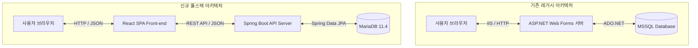

작성일: 2026년 6월 23일
작성자: PRODEV

## 1. 개요 및 마이그레이션 가능 여부
본 보고서는 2003년식 레거시 ASP.NET ERP 프로젝트를 최신 풀스택 아키텍처(Spring Boot + React + MariaDB 11.4)로 안전하게 마이그레이션하기 위한 기술 설계 및 로드맵입니다. 결론부터 말씀드리면, **마이그레이션은 완전히 가능**합니다. 20년 전 기술인 ASP.NET Web Forms 구조를 최신 아키텍처로 전환하면 유지보수 편의성, 성능, 그리고 보안 관점에서 큰 전환점이 될 것입니다.

## 2. 기술 스택 비교 및 전환 계획
기존 아키텍처와 새로 도입할 최신 아키텍처의 구성 요소를 비교하여 전환 계획을 수립합니다.
| 구분 | 기존 레거시 시스템 (ASP.NET 2003) | 신규 전환 시스템 (React + Spring Boot) | 전환 및 극복 방안 |
|---|---|---|---|
| **프레젠테이션** | ASP.NET Web Forms (`.aspx` 서버 사이드 렌더링) | React 18+ (Vite 빌드 도구 활용) | 컴포넌트 기반 UI 개발로 재사용성을 극대화하고 SPA[^1] 방식으로 사용자 경험을 대폭 향상합니다. |
| **비즈니스 로직** | C# 비하인드 코드 (`.aspx.cs`) 및 공통 클래스 | Spring Boot 3.x (Java 17/21) | 레이어드 아키텍처(Controller-Service-Repository)를 도입하여 비즈니스 로직의 응집도를 높이고 유지보수를 용이하게 합니다. |
| **데이터 액세스** | ADO.NET (직접 SQL 쿼리 실행 및 스토어드 프로시저) | Spring Data JPA 및 QueryDSL | 무분별한 직접 쿼리를 줄이고 JPA를 도입하되, 복잡한 ERP 통계성 쿼리는 QueryDSL이나 MyBatis를 조합하여 성능을 확보합니다. |
| **데이터베이스** | MSSQL-Server | MariaDB 11.4 (오픈소스) | 기존 MSSQL Dialect와 스키마를 MariaDB 11.4에 맞게 변환하고 데이터를 이전합니다. |
| **보고서 출력** | Crystal Reports (CrystalDecisions) | HTML5 Print CSS 및 Grid 라이브러리 | Active-X 기반 출력 대신 웹 표준(HTML5) 인쇄 전용 CSS 및 Grid 컴포넌트의 엑셀 다운로드 기능으로 대체합니다. |

## 3. 핵심 아키텍처 변화
기존의 모놀리식 단일 아키텍처에서 화면과 서버가 철저히 분리되는 REST API 기반 아키텍처로 전환합니다.

## 4. 단계별 마이그레이션 로드맵
성공적인 프로젝트 수행을 위해 아래와 같이 5단계의 로드맵을 제안합니다.

### 4.1. 1단계: 분석 및 데이터베이스 전환 (가장 중요)
- 4.1.1. MSSQL 스키마 분석: 테이블 구조, 제약 조건, 인덱스, 뷰, 스토어드 프로시저 등을 목록화합니다.
- 4.1.2. MariaDB 11.4 호환성 검증: MSSQL의 고유 문법(예: `ISNULL` -> `IFNULL`, `GETDATE()` -> `NOW()`, 대소문자 구분 정책 등)을 MariaDB 표준에 맞게 매핑 테이블을 작성합니다.
- 4.1.3. 스키마 마이그레이션: DDL 변환 도구(예: DBeaver, DBConvert 등)를 활용하여 MariaDB에 스키마를 생성합니다.
- 4.1.4. 데이터 이관 및 검증: ETL 도거나 스크립트를 작성하여 데이터를 마이그레이션하고 데이터 정합성을 검증합니다.

### 4.2. 2단계: 프론트엔드 기초 설계 및 공통 UI 개발
- 4.2.1. Vite + React 프로젝트 구성: CSS 변수를 기반으로 하는 다크모드 및 반응형 레이아웃을 구성합니다.
- 4.2.2. 공통 컴포넌트 설계: ERP에서 가장 빈번하게 사용되는 Grid, Form Control, Modal, 날짜 선택기(DatePicker) 등을 공통 컴포넌트화합니다.
- 4.2.3. 라우팅 인프라 구축: React Router를 통해 ERP 메뉴 체계를 동적으로 로드할 수 있도록 라우팅 환경을 설계합니다.

### 4.3. 3단계: 백엔드 API 설계 및 개발
- 4.3.1. Spring Boot 기본 설정: Spring Security, JWT 기반 인증, JPA, QueryDSL 설정을 완료합니다.
- 4.3.2. 엔티티 및 리포지토리 매핑: MariaDB 테이블에 대응하는 Java Entity 클래스를 작성하고 연관 관계를 맺습니다.
- 4.3.3. API 컨트롤러 구현: 기존 `.aspx.cs` 비하인드 코드에 분산되어 있던 데이터 처리 로직을 RESTful API 규격으로 재설계하여 구현합니다.

### 4.4. 4단계: 프론트-백엔드 연동 및 비즈니스 기능 마이그레이션
- 4.4.1. API 연동: React 화면에서 Axios 등을 사용하여 Spring Boot 서버와 통신하도록 구현합니다.
- 4.4.2. ERP 핵심 도메인 마이그레이션: 기준 정보, 영업 관리, 자재/구매 관리, 생산 관리, 품질 관리 등 핵심 도메인을 단계적으로 이관합니다.
- 4.4.3. 엑셀 업/다운로드 및 프린트: 대용량 데이터 엑셀 변환 기능 및 프린트 출력 최적화 작업을 진행합니다.

### 4.5. 5단계: 통합 테스트 및 배포
- 4.5.1. 시나리오 테스트: ERP 업무 흐름(주문 등록 -> 생산 의뢰 -> 구매 발주 -> 입고 -> 출하 -> 마감)에 따른 통합 테스트를 수행합니다.
- 4.5.2. 운영 서버 인프라 구축: Spring Boot는 Jar 형태로 배포하고, React는 정적 리소스로 빌드하여 Nginx를 통해 서빙할 수 있도록 배포 환경을 구성합니다.

> [!important] 마이그레이션 성공의 핵심 성공 요인
> 레거시 ERP의 가장 큰 복잡성은 스토어드 프로시저와 대량의 복잡한 쿼리입니다. 백엔드 전환 시, 프로시저의 비즈니스 로직을 가급적 Spring Boot 애플리케이션 레이어로 끌어올려 코드 중심의 버전 관리와 단위 테스트가 가능하도록 개선해야 합니다.

> [!tip] 추천 도구 및 방안
> 데이터베이스 스키마 및 데이터 마이그레이션 시에는 오픈소스 DB 관리 도구인 **DBeaver**의 내보내기/가져오기 기능이나 **DBConvert for MSSQL and MySQL** 같은 전용 마이그레이션 툴을 사용하는 것이 시행착오를 대폭 줄여줍니다.

[^1]: **SPA (Single Page Application)**: 단일 페이지로 구성되어 페이지 갱신 없이 필요한 부분의 데이터만 비동기로 로드하는 현대적인 웹 애플리케이션 아키처입니다.
