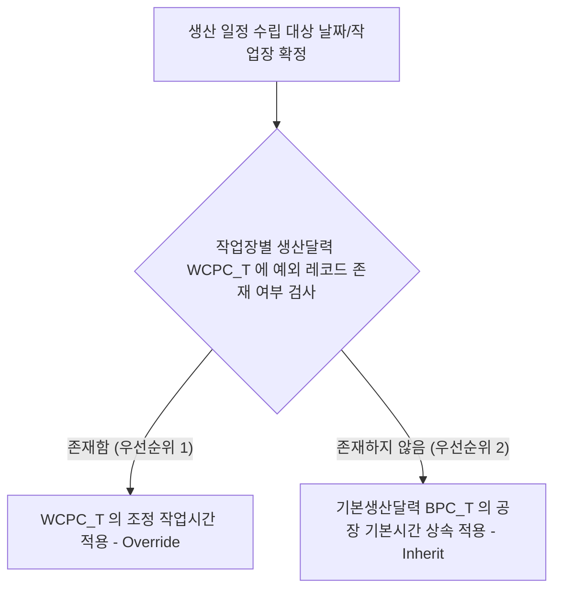

작성일: 2026년 6월 24일
작성자: PRODEV

## 1. 개요
생산달력(Production Calendar)은 공장의 가동일과 휴무일 및 일자별 가동시간을 정의하는 기준 마스터 정보입니다. 기존 레거시의 극단적인 비정규화 방식(1일부터 100일까지 가로로 컬럼을 100개씩 배치하던 구조)을 완전히 청산하고, 날짜별 1행 적재 방식의 정규화 모델로 전환합니다. 공장 전체에 일괄 적용되는 **'기본생산달력'**과 특정 작업장에 한해 가동시간을 커스텀 조정할 수 있는 **'작업장별 생산달력'**의 2단계 구조를 설계하여 유연한 스케줄링 환경을 구현합니다.

## 2. 데이터베이스 설계안 (BPC_T / WCPC_T)
각 테이블은 날짜(`DATE`) 필드를 내용키로 삼아 1일 1행 구조로 관리되며, 외래키 식별 원칙을 엄격하게 준수합니다.

### 2.1. 기본생산달력 테이블 (BPC_T)
공장 전체의 기본 가동 스케줄을 관리합니다.
| 컬럼명 | 데이터 타입 | Null 여부 | 속성 및 용도 |
|---|---|---|---|
| `Index` | `INT` | NOT NULL | 고유 식별 일련번호 (PK, AUTO_INCREMENT) |
| `CalendarDate` | `DATE` | NOT NULL | 기준 일자 (내용키, 날짜 포맷) |
| `WorkTime` | `DECIMAL(4,2)` | NOT NULL | 공장 기본 가동 시간 (단위: 시간, 기본값 8.00) |
| `Content` | `VARCHAR(255)` | NULL | 휴일 및 공장 일정 비고 (예: "신정 휴무") |
| `RecodingState` | `TINYINT(1)` | NOT NULL | 레코드 제어 상태 (소프트 삭제용 플래그, 기본값 1) |
| `RegistrationPerson` | `VARCHAR(255)` | NOT NULL | 등록자 |
| `RegistrationDate` | `DATETIME` | NOT NULL | 등록일시 |
| `UpdatingPerson` | `VARCHAR(255)` | NULL | 수정자 |
| `UpdatingDate` | `DATETIME` | NULL | 수정일시 |

### 2.2. 작업장별 생산달력 테이블 (WCPC_T)
특정 작업장의 가동시간 예외 조정 사양을 기록합니다.
| 컬럼명 | 데이터 타입 | Null 여부 | 속성 및 용도 |
|---|---|---|---|
| `Index` | `INT` | NOT NULL | 고유 식별 일련번호 (PK, AUTO_INCREMENT) |
| `WCIndex` | `INT` | NOT NULL | 대상 작업장 식별 인덱스 (FK, WCI_MT 참조) |
| `CalendarDate` | `DATE` | NOT NULL | 예외 조정 일자 (날짜 포맷) |
| `WorkTime` | `DECIMAL(4,2)` | NOT NULL | 조정된 가동 시간 (단위: 시간, 예: 12.00 또는 0.00) |
| `Content` | `VARCHAR(255)` | NULL | 예외 조정 사유 (예: "납기 긴급 야간근무") |
| `RecodingState` | `TINYINT(1)` | NOT NULL | 레코드 제어 상태 (소프트 삭제용 플래그, 기본값 1) |
| `RegistrationPerson` | `VARCHAR(255)` | NOT NULL | 등록자 |
| `RegistrationDate` | `DATETIME` | NOT NULL | 등록일시 |
| `UpdatingPerson` | `VARCHAR(255)` | NULL | 수정자 |
| `UpdatingDate` | `DATETIME` | NULL | 수정일시 |

> [!important] 내용키 유니크 제약 및 인덱스
> - `BPC_T`는 활성 데이터 기준 동일 일자가 중복 등록되지 않도록 `UQ_BPC_T_Date` 제약 조건을 적용했습니다.
> - `WCPC_T`는 특정 작업장별로 동일 날짜에 단 하나의 조정 레코드만 존재하도록 `WCIndex`와 `CalendarDate`를 조합한 복합 유니크 제약 `UQ_WCPC_T_WC_Date`를 적용했습니다.

## 3. 핵심 비즈니스 로직 및 제약 사항

### 3.1. 작업시간 상속 및 오버라이드(Override) 연산 아키텍처
생산계획 스케줄러가 특정 작업장($W$)의 특정 날짜($D$)에 가동할 수 있는 총 시간($\text{WorkTime}_{W,D}$)을 계산할 때, 아래의 우선순위 연산 체계를 수행합니다.

- 3.1.1. **1순위 (예외 적용):** 작업장별 생산달력(`WCPC_T`)에서 해당 작업장(`WCIndex`)과 해당 일자(`CalendarDate`)에 부합하는 활성 데이터가 존재하면, 해당 레코드의 `WorkTime` 값을 **최우선 적용**합니다.
- 3.1.2. **2순위 (기본 상속):** 조정 레코드가 존재하지 않는 일반적인 날짜의 경우에는 기본생산달력(`BPC_T`)에 등록된 해당 날짜의 `WorkTime`을 **자동 상속받아 기본 가동 시간으로 산출**합니다.

### 3.2. 예외 조정의 비즈니스 시나리오 예시
- **시나리오 A (야근/특근 가산):** 전체 공장은 기본생산달력에 따라 8시간 가동하지만, 조립 작업장은 납기 긴급 사유로 특정 주간 가동시간을 12시간으로 늘리고자 할 때 해당 일자의 `WorkTime`을 12.00으로 조정 등록합니다.
- **시나리오 B (설비 점검 가동중단):** 프레스 작업장의 설비 정기 점검이 예정된 날짜에 대해 가동 시간을 0.00으로 설정하면, 해당 일자의 생산 Capa는 0이 되어 스케줄러가 자동으로 일정을 우회 배치합니다.

## 4. 화면 (UI/UX) 구성안 (캘린더 렌더링 패턴)
데이터 입력의 편의성을 극대화하기 위해 표(Grid) 형태의 입력을 탈피하고 대형 시각 캘린더 컴포넌트를 제공합니다.

### 4.1. 기본생산달력 화면 구성
- 4.1.1. 화면 전체를 차지하는 대형 월별 캘린더가 렌더링됩니다.
- 4.1.2. 각 날짜 칸에는 설정된 기본 가동 시간(예: "8h", "휴무(0h)")과 메모가 텍스트 배지로 표출됩니다.
- 4.1.3. 특정 날짜를 클릭하면 우측 혹은 모달 팝업으로 상세 편집 폼(가동시간 입력란, 비고란)이 활성화되며, 저장 시 즉각 캘린더 상태에 반영됩니다.

### 4.2. 작업장별 생산달력 화면 구성
- 4.2.1. **좌측 영역 (작업장 선택):** 등록된 마스터 작업장 목록(`WCI_MT` 기반)을 그리드로 제공하고 선택하게 합니다.
- 4.2.2. **우측 영역 (예외 조정 캘린더):** 좌측에서 선택한 작업장의 개별 예외 캘린더를 렌더링합니다.
- 4.2.3. 특정 날짜를 클릭하여 기본 달력 대비 가동시간을 조정(시간 직접 입력)하고 예외 비고 사유를 작성할 수 있습니다. 예외가 적용된 날짜는 캘린더 상에 주황색 배경 등으로 강조 표시되어 기본 달력과 쉽게 구분되도록 돕습니다.
