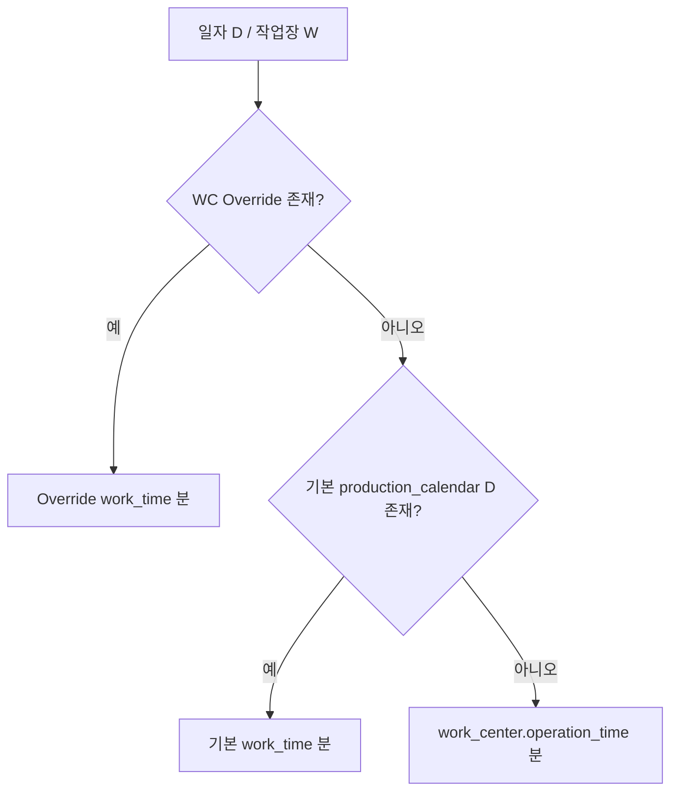

# 생산달력 기준정보 확정 스펙

> **문서 버전:** 1.0  
> **작성일:** 2026-06-24  
> **상태:** 확정안 (구현 대기)  
> **관련 Wave:** B5(현행) → **B5-R** (달력 정규화·Override·분 단위·UI)  
> **관련 문서:**  
> - [작업장 기준정보 확정 스펙](./basis-work-center-spec.md) §4.6·§4.7  
> - [기준정보 API·필드 매핑](./basis-information-api-spec.md) **§5.4a·§5.4b**  
> - [기준정보 구현 설계](./basis-information-implementation-spec.md)  
> - [production-work-report-mapping.md](./production-work-report-mapping.md) — PRD-W3 Capa

**업무 원본:** `260624_기준정보_생산달력.md` (PRODEV, 2026-06-24) — **단위는 분(INT)으로 확정**, 레거시 시간(h) 설계는 채택하지 않음.

---

## 1. 문서 목적·적용 범위

공장의 **가동일·휴무일·일자별 가동시간(분)** 을 정의하는 생산달력 마스터를 정리한다. 레거시 PCI 100일 가로 컬럼 **폐기** → **날짜 1행 정규화**.

| 구분 | 내용 |
|------|------|
| **2계층** | **기본생산달력** (`production_calendar`, `BPC_T`) + **작업장별 예외** (`work_center_calendar`, `WCPC_T`) |
| **Override** | 작업장 테이블은 **기본과 다른 날만** 저장(sparse). 없으면 기본달력 **상속** |
| **단위** | **`work_time` = 분(INT)** — `work_center.operation_time`(480분)과 **동일** |
| **회계달력** | `FiscalCalendarService` / `tenant_profile` — **별개** (전표·마감용) |
| **API·필드 SoT** | [basis-information-api-spec.md §5.4a·§5.4b](./basis-information-api-spec.md) |

---

## 2. UI 원칙 (달력 예외)

[거래처 스펙](./basis-company-spec.md) §2 CRUD 패턴과 달리, **날짜 마스터**는 월간 캘린더 UI를 사용한다.

| 항목 | 확정 |
|------|------|
| 기본생산달력 | **월간 캘린더** + 일자 클릭 → **Modal** (가동분·비고) |
| 작업장별 달력 | **좌: 작업장 목록** + **우: 월간 캘린더** + 일자 클릭 → Modal |
| 레거시 DataTable 일자 그리드 | B5-R에서 **교체** (현행 `WorkCenterCalendarsPage`) |
| 2분할 우측 상시 편집 패널 | **미사용** — Modal만 |

캘린더 칸 표시 예: `480분`, `휴무(0)`, Override `720분` (주황 배지).

---

## 3. 업무 정의

### 3.1 기본생산달력 (`production_calendar`)

공장 **전체**에 일괄 적용되는 기본 가동 스케줄.

| 구분 | 내용 |
|------|------|
| **PK** | `id` |
| **UK** | **`calendar_date`** (DATE) — 활성(`recoding_state = 1`) 구간 유일 |
| **`work_time`** | INT NOT NULL, **분**. 기본 **480** (8시간) |
| **`content`** | 휴일·공장 일정 비고 (예: "신정 휴무") |
| **`work_time = 0`** | **휴무** — 해당 일 Capa 0 |

### 3.2 작업장별 생산달력 (`work_center_calendar` — Override 전용)

특정 작업장의 **예외** 가동시간만 기록.

| 구분 | 내용 |
|------|------|
| **PK** | `id` |
| **FK** | `work_center_id` → `work_center.id` |
| **UK** | **`(work_center_id, calendar_date)`** — 활성 구간 유일 |
| **`work_time`** | INT NOT NULL, **분** (예: 720 야근, 0 설비점검) |
| **`content`** | 예외 사유 |
| **저장 범위** | **sparse** — 해당 일 **effective** 값이 기본달력과 **다를 때만** 행 유지 |

예외 행 **삭제**(또는 soft delete) → 해당 일은 **기본생산달력으로 복귀**.

### 3.3 Effective 가동시간 연산 (Capa·스케줄러 공통)

특정 작업장 \(W\), 일자 \(D\)의 **유효 가동분** \(\text{EffectiveMinutes}_{W,D}\):

```
1) work_center_calendar 에 (W, D) 활성 Override 있음
     → Override.work_time (분)          [우선순위 1]

2) 없음 → production_calendar 의 D.work_time (분)   [우선순위 2]

3) 없음 → work_center.operation_time (분)           [우선순위 3, 마스터 폴백]
```



**시나리오 A (야근):** 공장 기본 480분, 조립 작업장만 특정일 720분 Override 등록.  
**시나리오 B (점검):** 프레스 작업장 특정일 Override `0` → Capa 0, 스케줄 우회.

### 3.4 Capa 연계 (PRD-W3)

[작업장 스펙 §4.6](./basis-work-center-spec.md) — **분 단위 통일**:

| `capacity_distinction` | 일 Capa (분) |
|------------------------|--------------|
| `TIME` | \(\text{EffectiveMinutes}_{W,D}\) |
| `TIME_WORKERS` | \(\text{EffectiveMinutes}_{W,D} \times \text{retention\_staff}\) |

---

## 4. API·필드

**엔드포인트·필드는 [basis-information-api-spec.md §5.4a·§5.4b](./basis-information-api-spec.md) 를 따른다.**

### 4.1 REST API — 기본생산달력

| Method | Endpoint | 설명 |
|--------|----------|------|
| GET | `/api/v1/basis/production-calendars?year=&month=` | 월별 목록 |
| GET | `/api/v1/basis/production-calendars/{id}` | 단건 |
| PUT | `/api/v1/basis/production-calendars/by-date/{calendarDate}` | **upsert** by date |
| DELETE | `/api/v1/basis/production-calendars/by-date/{calendarDate}` | 소프트 삭제(또는 기본 480 복원 정책) |

### 4.2 REST API — 작업장별 (Override)

| Method | Endpoint | 설명 |
|--------|----------|------|
| GET | `/api/v1/basis/work-center-calendars/overrides?workCenterId=&year=&month=` | **Override 행만** |
| GET | `/api/v1/basis/work-center-calendars/effective?workCenterId=&year=&month=` | **연산 결과** (표시용) |
| PUT | `/api/v1/basis/work-center-calendars/overrides` | body upsert `{ workCenterId, calendarDate, workTime, content }` |
| DELETE | `/api/v1/basis/work-center-calendars/overrides?workCenterId=&calendarDate=` | Override 제거 → 기본 상속 |

> **현행 B5 (deprecated):** `GET .../standard`, `wcName` 문자열, year/month/day 분리, 전량 복사 — B5-R에서 **폐지**.

### 4.3 필드 매핑

**`production_calendar`**

| 화면 | 필수 | API (요청) | API (응답) | DB |
|------|:----:|------------|------------|-----|
| (시스템) | | — | `id` | `id` |
| 일자 | ● | `calendarDate` | `calendarDate` | `calendar_date` |
| 가동시간(분) | ● | `workTime` | `workTime` | `work_time` INT |
| 비고 | | `content` | `content` | `content` |

**`work_center_calendar` (Override)**

| 화면 | 필수 | API (요청) | API (응답) | DB |
|------|:----:|------------|------------|-----|
| 작업장 | ● | `workCenterId` | `workCenterId`, `wcName` | `work_center_id` |
| 일자 | ● | `calendarDate` | `calendarDate` | `calendar_date` |
| 가동시간(분) | ● | `workTime` | `workTime` | `work_time` INT |
| 비고 | | `content` | `content` | `content` |

**effective 응답 추가 필드:** `effectiveWorkTime`, `isOverride`, `baseWorkTime`(해당 일 기본달력 분, nullable).

### 4.4 B5-R 스키마 변경

| 현행 `work_center_calendar` | TO-BE |
|-----------------------------|-------|
| `calendar_year`, `month_num`, `day_num` | **`calendar_date` DATE** |
| `work_time` DECIMAL(10,2), 시드 8 | **`work_time` INT**, 분, 기본 **480** |
| UK `(wc, y, m, d, work_time)` | Override UK **`(work_center_id, calendar_date)`** |
| `기준작업장` WC에 전 일자 행 | **`production_calendar`** 별도 테이블 |
| 작업장 등록 시 **전량 복사** | **복사 없음** (§5.1) |

**신규 `production_calendar`**

```sql
CREATE TABLE production_calendar (
    id              BIGINT AUTO_INCREMENT PRIMARY KEY,
    calendar_date   DATE           NOT NULL,
    work_time       INT            NOT NULL DEFAULT 480,
    content         VARCHAR(255)   NULL,
    recoding_state  TINYINT        NOT NULL DEFAULT 1,
    created_at      TIMESTAMP(3)   NOT NULL DEFAULT CURRENT_TIMESTAMP(3),
    created_by      VARCHAR(50)    NOT NULL,
    updated_at      TIMESTAMP(3)   NULL,
    updated_by      VARCHAR(50)    NULL,
    CONSTRAINT uk_production_calendar_date UNIQUE (calendar_date)
);
```

**`work_center_calendar` (Override, B5-R)**

```sql
-- calendar_date 추가, y/m/d 제거 후 UK (work_center_id, calendar_date)
-- work_time INT NOT NULL
```

### 4.5 시스템 필드

| 컬럼 | 설명 |
|------|------|
| `id` | PK |
| `created_by` / `created_at` | 등록 |
| `updated_by` / `updated_at` | 수정 |
| `recoding_state` | `1`=유효, `0`=삭제 |

---

## 5. §5.4a·§5.4b 외 확정 사항

### 5.1 작업장 등록 후처리 (B5 → B5-R 변경)

| B5 (현행) | B5-R (확정) |
|-----------|-------------|
| `WorkCenterRegisteredEvent` → `copyFutureFromTemplate()` | **제거(no-op)** |
| `기준작업장` WC 달력을 신규 WC에 복사 | **모든 WC는 기본달력 상속** — Override 없으면 effective = `production_calendar` |
| `GET .../work-center-calendars/standard` | **`GET .../production-calendars`** |

[작업장 스펙 §4.7](./basis-work-center-spec.md) — 본 스펙으로 **위임**.

### 5.2 유효성

| 규칙 | 내용 |
|------|------|
| `work_time` | INT, **0 ~ 1440** (24×60). [작업장 §5.3](./basis-work-center-spec.md) 상한과 동일 |
| `calendar_date` | 유효일 |
| `work_center_id` | 활성 `work_center` FK |
| Override upsert | `work_time`가 **해당 일 기본 effective(Override 제외)** 와 **동일**하면 → Override 행 **삭제**(자동 정리, 선택 구현) |

### 5.3 `기준작업장` WC

B5 시드 `기준작업장` + PCI 템플릿 행 → B5-R Flyway에서:

1. `production_calendar` 로 **이관** (`calendar_date`, `work_time` 분 변환: `8` → `480`)  
2. `work_center_calendar` 의 **비-Override 복사본** 정리  
3. `기준작업장` WC — Capa/레거시 호환용 **유지 여부**는 운영 정책(삭제 가능, 달력 템플릿 역할 **폐지**)

### 5.4 삭제·참조

- 작업장 `recoding_state = 0` — Override 행 **유지**(이력) vs cascade — B5-R에서 **유지** (작업장 스펙 §5.4와 동일)
- `production_calendar` 휴무(0분) — **전 작업장** effective에 반영(Override 없을 때)

---

## 6. 화면

### 6.1 기본생산달력 (`/basis/production-calendars`)

```
┌─────────────────────────────────────────────────────────┐
│ 기본생산달력                        [◀ 2026년 6월 ▶]     │
├─────────────────────────────────────────────────────────┤
│              (월간 캘린더 컴포넌트)                       │
│   각 칸: 480분 / 휴무(0) / 비고 배지                      │
│   일자 클릭 → Modal: 가동시간(분), 비고                   │
└─────────────────────────────────────────────────────────┘
```

| 요소 | 동작 |
|------|------|
| API | `GET /production-calendars?year=&month=` |
| 저장 | `PUT .../by-date/{calendarDate}` |
| 기본값 | 신규 일자 최초 편집 시 **480분** |

### 6.2 작업장별 생산달력 (`/basis/work-center-calendars`)

```
┌──────────────┬──────────────────────────────────────────┐
│ 작업장        │  [◀ 2026년 6월 ▶]                         │
│ (목록/Select) │  (월간 캘린더 — effective 표시)            │
│              │  Override 일: 주황 배지 + 조정 분           │
│              │  클릭 → Modal: workTime(분), content       │
│              │  [예외 해제] → DELETE override             │
└──────────────┴──────────────────────────────────────────┘
```

| 요소 | 동작 |
|------|------|
| 좌측 | `WorkCenterSelect` 또는 작업장 그리드 |
| 우측 API | `GET .../effective?workCenterId=&year=&month=` |
| Override 저장 | `PUT .../overrides` |
| 예외 해제 | `DELETE .../overrides?workCenterId=&calendarDate=` |

---

## 7. API 예시

**PUT** `/api/v1/basis/production-calendars/by-date/2026-06-24`

```json
{
  "workTime": 0,
  "content": "설비 정기점검 — 공장 휴무"
}
```

**PUT** `/api/v1/basis/work-center-calendars/overrides`

```json
{
  "workCenterId": 3,
  "calendarDate": "2026-06-25",
  "workTime": 720,
  "content": "납기 긴급 야간근무"
}
```

**GET** `.../effective?workCenterId=3&year=2026&month=6` — 응답 일부

```json
{
  "calendarDate": "2026-06-25",
  "effectiveWorkTime": 720,
  "isOverride": true,
  "baseWorkTime": 480,
  "content": "납기 긴급 야간근무"
}
```

```json
{
  "calendarDate": "2026-06-26",
  "effectiveWorkTime": 480,
  "isOverride": false,
  "baseWorkTime": 480,
  "content": null
}
```

---

## 8. 현행 B5 vs TO-BE

| 항목 | B5 (현행) | TO-BE |
|------|-----------|-------|
| 기본 달력 | `기준작업장` WC 행 | **`production_calendar`** |
| WC 데이터 | 전일 **복사(full)** | **sparse Override** |
| `work_time` | DECIMAL, 값 8 (시간 혼용) | **INT 분**, 480 |
| 날짜 키 | year / month / day | **`calendar_date`** |
| UK | `(wc, y, m, d, work_time)` | `(wc, calendar_date)` / `(calendar_date)` |
| API | `wcName`, `/standard` | `workCenterId`, `/production-calendars` |
| UI | DataTable + Modal | **월 캘린더** + Modal |
| 등록 후처리 | copyFutureFromTemplate | **없음** |

---

## 9. 구현·후속 Wave

### 9.1 B5-R — 생산달력

- [ ] Flyway: `production_calendar` 생성; `기준작업장` 시드 → 이관 (`×60` 분)
- [ ] Flyway: `work_center_calendar` → `calendar_date`, `work_time` INT, UK 변경; full copy 행 정리
- [ ] `ProductionCalendarService` — CRUD by date
- [ ] `WorkCenterCalendarService` — Override CRUD + `resolveEffectiveMinutes(wcId, date)`
- [ ] `WorkCenterRegisteredListener` — **copy 제거**
- [ ] 프론트 — `ProductionCalendarsPage`, `WorkCenterCalendarsPage` 캘린더 UI
- [ ] [basis-information-api-spec.md](./basis-information-api-spec.md) §5.4a·§5.4b 동기화
- [ ] [basis-work-center-spec.md](./basis-work-center-spec.md) §4.7·§10 갱신

### 9.2 후속 (PRD-W3)

- [ ] 작업계획·Capa — `EffectiveMinutes` 연동
- [ ] (선택) 월 일괄 휴무·일괄 480분 템플릿 API

---

## 10. 의사결정 요약

| 항목 | 확정 |
|------|------|
| 구조 | **기본달력** + **작업장 Override(sparse)** |
| `work_time` | **분(INT)**, 기본 **480** |
| 연산 | Override → 기본달력 → `operation_time` 폴백 |
| UI | **월 캘린더** + Modal (CRUD 마스터와 예외) |
| 작업장 등록 | 달력 **복사 없음** |
| 260624 시간(h) | **미채택** |
| API SoT | **basis-information-api-spec §5.4a·§5.4b** |

---

## 11. 문서 이력

| 버전 | 일자 | 내용 |
|------|------|------|
| 1.0 | 2026-06-24 | 초안 — Override + 분(INT); `260624_기준정보_생산달력.md` 기반 |
