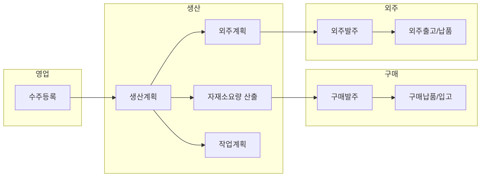

# KIT_ERP 업무 흐름 개정안 (TO-BE)

> **문서 버전:** 1.0  
> **작성일:** 2026-06-22  
> **기준 문서:** `업무 흐름도.pdf` (레거시 AS-IS)  
> **상태:** TO-BE 확정 — 신규 이관 시 본 문서 우선

---

## 1. 문서 목적

레거시 업무 흐름도에 포함된 **중간 의뢰 단계**를 제거하고, 신규 KIT_ERP의 프로세스·원장·API·Wave 범위를 단순화한다.

**우선순위:** 본 문서와 `docs/*.md` 설계서가 충돌할 경우 **본 문서(TO-BE)** 를 따른다.

**구현 순서 (확정):**

1. **INF-2** — 회계월(`FiscalCalendarService`)·월마감(`month_closing`) 연동 ✅  
2. **TX1** — 구매발주 → 구매납품(입고) E2E (회계월·마감 규칙 준수) ✅

---

## 2. AS-IS → TO-BE 변경 요약

| 구분 | AS-IS (레거시 흐름도) | TO-BE (신규) | 비고 |
|------|------------------------|--------------|------|
| 영업→생산 | 수주 → **생산의뢰** → 생산계획 | 수주 → 생산계획 | 생산의뢰 원장·화면 **삭제** |
| 생산→구매 | 자재소요 산출 → **구매의뢰** → 구매발주 | 자재소요 산출 → 구매발주 | 구매의뢰 원장·화면 **삭제** |
| 생산→외주 | 외주계획/작업계획 → **외주의뢰** → 외주발주 | 외주계획 수립 → 외주발주 | 외주의뢰 원장·화면 **삭제** |

**유지:** 구매발주 → 구매납품 → (품질검사) → 구매입고, 외주발주 → 외주출고 → 외주납품, 작업계획·작업일보·출고·매출·수금·지급 등 **발주 이후** 흐름은 레거시 흐름도와 동일하게 유지한다.

---

## 3. TO-BE 메인 프로세스

```text
[영업]
  수주등록
    → 생산계획                    ※ 생산의뢰 없음

[생산]
  생산계획
    → 자재소요량 산출
         → 구매발주              ※ 구매의뢰 없음
    → 외주계획 수립
         → 외주발주              ※ 외주의뢰 없음
    → 작업계획 → 작업지시 → 작업일보

[구매]
  구매발주 → 구매납품 → [품질검사] → 구매입고 → 원자재창고

[외주]
  외주발주 → 외주출고 → 외주납품 → (생산창고 / 외주창고)

[영업·재고]
  제품출고 → 매출등록 → 수금등록 / 지급등록
```

### 3.1 영업 측 상품 구매

레거시 **상품구매의뢰**도 TO-BE에서는 **구매발주로 직접** 연결한다.

- 수주·재고 정책에 따라 상품 품목은 **구매발주**에서 처리한다 (별도 의뢰 단계 없음).
- 발주 헤더에 `source_type` (예: `MRP`, `SALES_ORDER`, `MANUAL`)으로 출처만 기록한다.

### 3.2 수주와 구매의 관계

- **원자재 구매**는 수주 없이도 가능하다 (자재소요·안전재고·수동 발주).
- **수주**는 생산계획의 입력이며, 구매의 필수 선행 조건이 아니다.

---

## 4. 삭제 대상 (신규 시스템에 구현하지 않음)

| 항목 | 레거시 대응(참고) | 조치 |
|------|-------------------|------|
| 생산의뢰 | 생산의뢰 원장·화면 | **미구현** — 수주가 생산계획 생성 트리거 |
| 구매의뢰 | 구매의뢰 원장 | **미구현** — 자재소요 산출 결과가 발주 후보 |
| 외주의뢰 | 외주의뢰 원장 | **미구현** — 외주계획이 발주 후보 |

**원칙:** 위 3단계용 테이블·API·권한·화면을 **신규로 만들지 않는다.** ETL 시 레거시 의뢰 데이터는 이력 참고용으로만 보관·매핑 가능하다.

---

## 5. 도메인별 상세 규칙

### 5.1 수주 → 생산계획

- 수주 확정(또는 등록 정책에 따른 시점) 시 **생산계획**을 생성한다.
- 생산계획은 수주 라인·품목·수량·납기를 참조한다 (`sales_order_id` / `sales_order_line_id` FK 권장).
- **생산의뢰** 중간 상태·승인 단계 없음 — 필요 시 수주 `status`로 대체한다.

### 5.2 자재소요 → 구매발주

- BOM·생산계획 기반 **자재소요량 산출** 완료 후, 부족분에 대해 **즉시 구매발주**를 생성한다.
- 발주 참조: `mrp_run_id` 또는 `material_requirement_line_id` (구현 시 명명).
- **구매의뢰** 승인·대기 큐 없음 — `purchase.order_policy.*` 시스템 설정으로 통제한다.

### 5.3 외주계획 → 외주발주

- 공정·작업계획에서 외주 대상 확정 시 **외주계획** 수립 후 **즉시 외주발주**한다.
- 발주비율(`outsideOrderRate` / plan 공정)은 기준정보(B2)를 따른다.
- **외주의뢰** 단계 없음.

### 5.4 구매·외주 발주 이후

| 구분 | 흐름 | 신규 모듈 |
|------|------|-----------|
| 구매 | 발주 → 납품 → 입고 → 원자재창고 + 매입원장 | TX1 (`inventory-ledger-spec.md`) |
| 외주 | 발주 → 출고 → 납품 → 외주창고/생산창고 | INF-4 |
| 품질 | 검사품은 입고 이벤트 지연 | TX1 `progress_condition=대기` |

### 5.5 회계월·마감 (INF-2 선행)

- 모든 입고·원장 반영은 **회계월(25일 규칙)** 기준으로 `inventory_balance_monthly`·`partner_ledger_monthly`에 기록한다.
- **마감된 연·월**에는 트랜잭션 등록·수정을 차단한다 (`month_closing`).
- TX1 구현 전 INF-2 완료를 전제로 한다.

---

## 6. Wave·구현 영향

| Wave | 영향 |
|------|------|
| **INF-2** | `FiscalCalendarService`, `POST /system/month-closings`, 트랜잭션 가드 — **TX1 선행 필수** |
| **TX1** | `purchase_order` + `purchase_receipt` — **구매의뢰 테이블 없음**. 발주 `source_type` / `requirement_line_id` nullable FK |
| **생산** (미정) | `production_plan` 수주 직연 — `production_request` 없음 |
| **MRP** (미정) | 산출 결과 → 구매발주 API 직접 호출 |
| **INF-4** | 외주계획 → `outsourcing_order` — **외주의뢰 없음** |
| **ETL** | 생산의뢰/구매의뢰/외주의뢰 원장은 참조·이력용; 신규 SoT 아님 |

---

## 7. 창고·원장 (레거시 흐름도 대응)

### 7.1 창고 (5종)

| 흐름도 | 신규 `inventory_location` |
|--------|---------------------------|
| 원자재창고 | RAW |
| 생산창고 | WIP |
| 납품창고 | DELIVERY |
| 영업창고 | SALES_1 ~ SALES_3 |
| 외주창고 | OUTSOURCE |

### 7.2 원장 (의뢰 원장 제외)

TO-BE에서 **사용하는** 원장 예시:

- 수주원장, 생산계획원장, 자재소요원장, 작업계획원장, 작업일보원장  
- 구매발주원장, 구매납품원장, 입고원장, 매입원장  
- 외주발주원장, 외주출고원장, 외주납품원장  
- 출고원장, 매출원장, 수금원장, 지급원장  

**제외:** 생산의뢰원장, 구매의뢰원장, 외주의뢰원장, 구매납품의뢰원장, 외주납품의뢰원장

---

## 8. 다이어그램 (TO-BE)



---

## 9. 관련 문서

| 문서 | 역할 |
|------|------|
| [inventory-ledger-spec.md](./inventory-ledger-spec.md) | 재고·원장·TX1 상세 |
| [system-information-spec.md](./system-information-spec.md) | 월마감 API·RBAC |
| [IMPLEMENTATION_PROCEDURE.md](../backend/docs/IMPLEMENTATION_PROCEDURE.md) | Wave 순서·승인 |
| [production-work-report-mapping.md](./production-work-report-mapping.md) | `production_result` → 작업일보 정식화 설계 |

---

## 10. 문서 이력

| 버전 | 일자 | 내용 |
|------|------|------|
| 1.0 | 2026-06-22 | 초안 — 의뢰 3단계 제거, INF-2 → TX1 순서 확정 |
