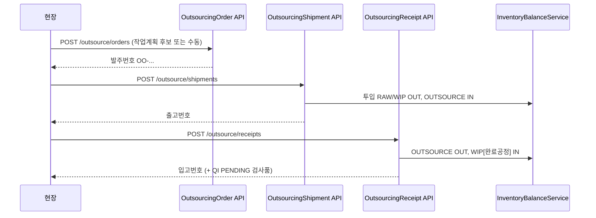

# 외주 INF-4 — 외주발주·출고·입고 설계 (PRD)

> **문서 버전:** 0.1 (초안)  
> **작성일:** 2026-07-06  
> **상태:** INF-4a 구현 진행 — 외주발주  
> **관련 문서:**  
> - [business-workflow-revision.md](./business-workflow-revision.md) §3, §5.3~5.4  
> - [inventory-ledger-spec.md](./inventory-ledger-spec.md) §3.1, §10 INF-4  
> - [basis-unit-cost-spec.md](./basis-unit-cost-spec.md) — 외주단가  
> - [purchase-receipt-quality-spec.md](./purchase-receipt-quality-spec.md) — QI 패턴  
> - [basis-company-spec.md](./basis-company-spec.md) — 미지급·`outsource_history`

---

## 1. 문서 목적

TO-BE 외주 흐름 **외주계획(작업계획) → 외주발주 → 외주출고 → 외주입고(납품)** 을 정의한다.  
**외주의뢰 원장·화면은 구현하지 않는다** ([business-workflow-revision.md](./business-workflow-revision.md) §4).

**UX:** 등록 1번 = 재고·원장 반영 (검사품 외주입고만 QI 2단계).

---

## 2. TO-BE 흐름

```text
work_plan (work_distinction=OUTSOURCE)
  → outsourcing_order (외주발주)     ← INF-4a 【본 구현】
  → outsourcing_shipment (외주출고)  ← INF-4b
       RAW/WIP OUT → OUTSOURCE[partner] IN (투입)
  → outsourcing_receipt (외주입고)   ← INF-4c
       OUTSOURCE OUT / WIP IN (완료공정)
       검사품 → quality_inspection (source_type=OUTSOURCE)
       outsource_history + PURCHASE 원장 미지급
```



---

## 3. Wave 분할

| Wave | ID | 범위 | 산출물 |
|------|-----|------|--------|
| **4a** | INF-4a | **외주발주** | `outsourcing_order`, API, `OutsourcingOrderPage` |
| **4b** | INF-4b | **외주출고** | `outsourcing_shipment`, OUTSOURCE 투입 재고 |
| **4c** | INF-4c | **외주입고** | `outsourcing_receipt`, QI(OUTSOURCE), `outsource_history` |
| **4d** | INF-5 | 지급·통계 | `partner_payment`, 비용 통계 (후속) |

---

## 4. 테이블 (INF-4a — 외주발주)

### 4.1 `outsourcing_order`

| 컬럼 | 타입 | 설명 |
|------|------|------|
| `id` | BIGINT PK | 시스템 |
| `order_no` | VARCHAR(30) | `OO-yyyyMMdd-순번` UK |
| `partner_id` | BIGINT FK | `company`, 역할 **OUTSOURCE** |
| `order_date` | DATE | 발주일 |
| `source_type` | ENUM | `WORK_PLAN`, `MANUAL` |
| `status` | ENUM | `CONFIRMED`, `IN_PROGRESS`, `RECEIVED`, `CANCELLED` |
| `recording_state` | TINYINT | 1=활성, 0=소프트삭제 |
| `created_*`, `updated_*` | | 감사 (API 수신 금지) |

> 등록 시 **즉시 `CONFIRMED`** (확정 UI 없음, 구매발주 DRAFT 패턴 미사용).

### 4.2 `outsourcing_order_line`

| 컬럼 | 타입 | 설명 |
|------|------|------|
| `id` | BIGINT PK | |
| `outsourcing_order_id` | BIGINT FK | |
| `line_no` | SMALLINT | |
| `item_id` | BIGINT FK | **제품·공정품**만 |
| `process_sequence_id` | BIGINT FK | 외주 대상 공정 |
| `begin_process_code_id` | BIGINT FK | 외주단가 구간 (시작) |
| `end_process_code_id` | BIGINT FK | 외주단가 구간 (종료) |
| `work_plan_id` | BIGINT FK NULL | `WORK_PLAN` 출처 |
| `order_qty` | DECIMAL(18,4) | 발주수량 |
| `shipped_qty` | DECIMAL(18,4) | 출고 누적 (4b) |
| `received_qty` | DECIMAL(18,4) | 입고 누적 (4c) |
| `unit_price` | DECIMAL(18,2) | 외주단가 |
| `amount` | DECIMAL(18,2) | |
| `requested_delivery_date` | DATE NULL | 납기 |
| 감사 컬럼 | | |

**UK:** `(outsourcing_order_id, line_no, recording_state)`

---

## 5. 재고 이동 (INF-4b·4c — 참고)

| TX | 이동 | 슬롯 |
|----|------|------|
| **외주출고** | 투입 자재·반제품 **OUT** | RAW 또는 WIP[`input_process_id`] |
| | 외주창고 **IN** | OUTSOURCE + `partner_id` + `input_process_id` |
| **외주입고(무검사)** | 외주창고 **OUT** | OUTSOURCE |
| | 생산창고 **IN** | WIP[`end_process` of segment] |
| **외주입고(검사품)** | 입고 등록 → QI PENDING, 합격분 창고 반영 | 구매입고와 동일 2단계 |

`OutsourceInputBalanceProjector`가 단가 등록 시 OUTSOURCE 투입 슬롯을 Lazy ensure — **출고 TX에서 잔고 검증**.

---

## 6. API (INF-4a)

**Base:** `/api/v1/outsource/orders`

| Method | Path | 권한 | 설명 |
|--------|------|------|------|
| GET | `/` | `outsource:order:read` | 목록 (기간·거래처·번호·상태) |
| GET | `/{id}` | read | 상세 |
| GET | `/work-plan-candidates` | read | `work_distinction=OUTSOURCE` 잔량·외주단가 후보 |
| GET | `/next-order-no` | read/write | `OO-yyyyMMdd-n` 미리보기 |
| POST | `/` | `outsource:order:write` | 수동 발주 |
| POST | `/from-work-plan` | write | 작업계획 기반 발주 |
| POST | `/{id}/cancel` | write | 취소 (출고·입고 없을 때) |

### 6.1 작업계획 후보 (`work-plan-candidates`)

- 대상: `work_plan.status=PLANNED`, `work_distinction=OUTSOURCE`
- `remainingQty = planned_qty − Σ(활성 발주 order_qty)` (동일 `work_plan_id`)
- 거래처·단가: `unit_cost` `OUTSOURCE`, 품목·적용일·**발주비율 100%** (구매 MRP 발주 패턴)
- `orderable=false` 시 사유 메시지

### 6.2 검증

| 항목 | 규칙 |
|------|------|
| 거래처 | `CompanyRoleType.OUTSOURCE` |
| 품목 | `제품`, `공정품` |
| 수량 | `order_qty > 0`, 작업계획 잔량 이내 |
| 단가 | 요청 단가 ≥ 0; WORK_PLAN 시 해당 거래처·구간 활성 외주단가 권장 |
| 취소 | `shipped_qty=0` AND `received_qty=0` |

---

## 7. 화면 (INF-4a)

**메뉴:** 외주 > **외주발주** (`outsource-order`)

| 영역 | 내용 |
|------|------|
| 상단 | 작업계획 발주 후보 (잔량·거래처·단가·납기) |
| 하단 | 발주 목록 (필터·취소) |
| 동작 | 후보 선택 → 거래처별 `POST /from-work-plan` (구매 MRP 발주 UI 패턴) |

출고·입고 화면은 INF-4b·4c에서 Placeholder 해제.

---

## 8. 권한

```text
outsource:order:read
outsource:order:write
```

| 역할 | read | write |
|------|------|-------|
| SYSTEM_ADMIN | ✅ | ✅ |
| PRODUCTION_OPERATOR | ✅ | ✅ |
| VIEWER | ✅ | — |

---

## 9. 구현 체크리스트

### INF-4a (외주발주) — 진행 중

- [ ] `V046__outsourcing_order.sql`
- [ ] `OutsourcingOrderService` + Repository
- [ ] `OutsourcingOrderController`
- [ ] `OutsourcingOrderPage.tsx`
- [ ] E2E: 작업계획(OUTSOURCE) → 발주 → 목록 조회

### INF-4b (외주출고) — 대기

- [ ] `outsourcing_shipment` + line
- [ ] OUTSOURCE IN / RAW·WIP OUT
- [ ] 발주 `shipped_qty` 갱신

### INF-4c (외주입고) — 대기

- [ ] `outsourcing_receipt` + line
- [ ] `outsource_history`, 미지급 원장
- [ ] QI `source_type=OUTSOURCE` FK 확장

---

## 10. 문서 이력

| 일자 | 내용 |
|------|------|
| 2026-07-06 | INF-4 초안 — 4a 발주 테이블·API·재고·화면, 4b·4c 개요 |
