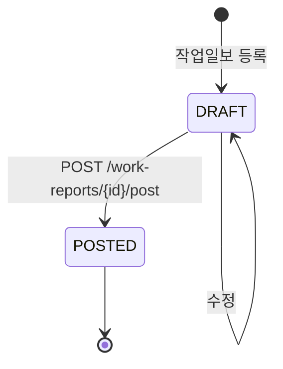
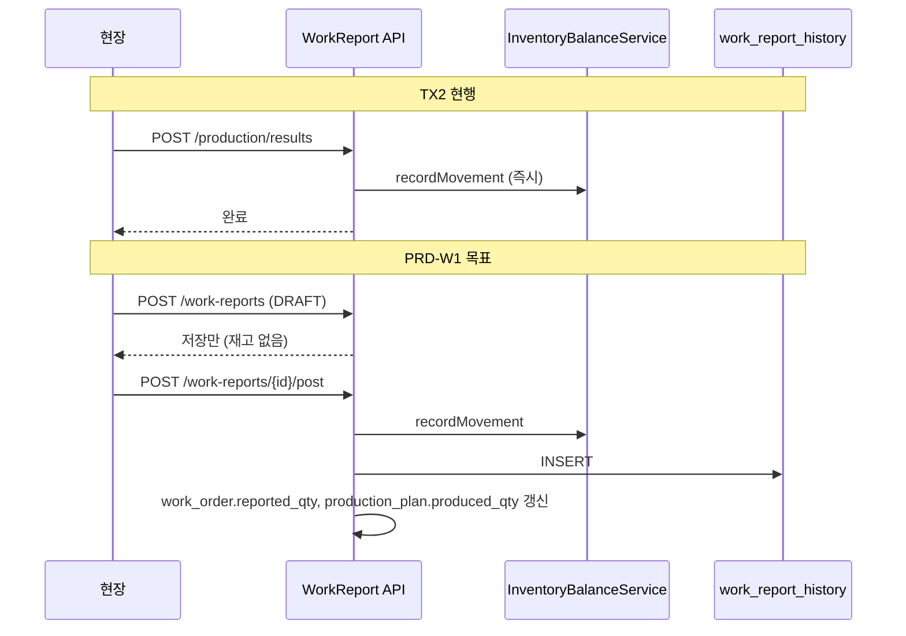

# 생산실적(`production_result`) → 작업일보 체계 매핑 설계안

> **문서 버전:** 1.0  
> **작성일:** 2026-06-22  
> **상태:** 설계안 (미구현)  
> **관련 Wave:** TX2(현행 파일럿) → **PRD-W1**(작업계획·지시·일보)  
> **관련 문서:**  
> - [업무 흐름 TO-BE](./business-workflow-revision.md)  
> - [재고·원장 설계](./inventory-ledger-spec.md)  
> - [기준정보 구현 설계](./basis-information-implementation-spec.md)

---

## 1. 문서 목적

TX2에서 도입한 `production_result`(생산실적)는 **재고·출고 E2E를 빠르게 검증**하기 위한 단축 구현이다.  
본 문서는 레거시·TO-BE의 **작업계획 → 작업지시 → 작업일보** 흐름으로 정식화할 때,

- 테이블 구조
- 상태 전이
- **재고 반영 시점**
- 기존 `production_result`와의 관계

를 정의한다.

---

## 2. 현행(TX2) 요약

### 2.1 테이블

| 테이블 | 역할 |
|--------|------|
| `production_plan` | 생산계획 (`planned_qty`, `produced_qty`, `status`) |
| `production_result` | 공정별 양품/스크랩 실적 (작업일보 역할의 축소판) |
| `sales_shipment` | 제품출고 (DELIVERY `ISSUE`) |

### 2.2 현행 API

- `POST /api/v1/production/results` — 등록 **즉시** 재고 이동

### 2.3 현행 재고 로직 (요약)

```
등록 시점(동기):
  WIP[현재공정] ISSUE (양품+스크랩)
  → 다음 사내공정 있으면 WIP[다음공정] RECEIPT (양품만)
  → 없으면 DELIVERY RECEIPT (양품만)
```

### 2.4 현행 한계

| 항목 | 내용 |
|------|------|
| 작업지시 없음 | 현장 “무엇을·얼마나” 만들지 지시 단위 부재 |
| 작업표준 미연계 | `work_standard`(WSI) 참조 없음 |
| 작업일보원장 없음 | `sales_history`/`purchase_history`와 대칭되는 생산 이력 테이블 없음 |
| 수정·취소 없음 | 등록 후 역전기·마감 가드만 있고 상태 머신 없음 |
| 외주 혼선 방지 | OUTSOURCE 공정은 차단 (INF-4 사용) — **유지** |

---

## 3. TO-BE 목표 구조

### 3.1 프로세스 (사내공정)

```text
production_plan (생산계획)
    → work_plan (작업계획)          … 계획 수량·공정·일정 슬롯
        → work_order (작업지시)     … 현장 지시 단위 (잔량 관리)
            → work_report (작업일보) … 실적 입력 (초안)
                → POST (전기)       … 재고·원장 반영 확정
```

외주 공정은 기존과 동일하게 **INF-4** (`outsource_shipment` / `outsource_receipt`)만 사용한다.

### 3.2 레거시 대응 (참고)

| 신규 | 레거시 개념 | 비고 |
|------|-------------|------|
| `work_plan` | 작업계획원장 | 생산계획 하위 |
| `work_order` | 작업지시 | 공정·수량·작업장 |
| `work_report` | 작업일보 / `ProductionResultPC` | 양품·불량·공수 |
| `work_report_history` | 작업일보원장 | 전기 후 이력 (불변) |

---

## 4. 신규 테이블 설계

### 4.1 `work_plan` (작업계획)

```sql
CREATE TABLE work_plan (
    id                  BIGINT AUTO_INCREMENT PRIMARY KEY,
    plan_num            VARCHAR(50)    NOT NULL,
    production_plan_id  BIGINT         NOT NULL,
    process_sequence_id BIGINT         NOT NULL,
    planned_qty         DECIMAL(18, 4) NOT NULL,
    plan_start_date     DATE           NULL,
    plan_end_date       DATE           NULL,
    status              VARCHAR(20)    NOT NULL DEFAULT 'PLANNED',
    recoding_state      TINYINT        NOT NULL DEFAULT 1,
    created_at          TIMESTAMP(3)   NOT NULL DEFAULT CURRENT_TIMESTAMP(3),
    created_by          VARCHAR(50)    NOT NULL,
    CONSTRAINT uk_work_plan_num UNIQUE (plan_num),
    CONSTRAINT fk_wp_pp FOREIGN KEY (production_plan_id) REFERENCES production_plan (id),
    CONSTRAINT fk_wp_ps FOREIGN KEY (process_sequence_id) REFERENCES process_sequence (id)
);
```

- **UK 권장:** `(production_plan_id, process_sequence_id)` — 동일 생산계획·공정에 작업계획 1건
- **생성 시점:** 생산계획 확정 시 자동 생성(옵션) 또는 `POST .../work-plans` 수동

### 4.2 `work_order` (작업지시)

```sql
CREATE TABLE work_order (
    id                  BIGINT AUTO_INCREMENT PRIMARY KEY,
    order_num           VARCHAR(50)    NOT NULL,
    work_plan_id        BIGINT         NOT NULL,
    work_standard_id    BIGINT         NULL,          -- plan WSI 참조 (optional)
    order_qty           DECIMAL(18, 4) NOT NULL,
    reported_qty        DECIMAL(18, 4) NOT NULL DEFAULT 0,
    order_date          DATE           NOT NULL,
    status              VARCHAR(20)    NOT NULL DEFAULT 'OPEN',
    recoding_state      TINYINT        NOT NULL DEFAULT 1,
    created_at          TIMESTAMP(3)   NOT NULL DEFAULT CURRENT_TIMESTAMP(3),
    created_by          VARCHAR(50)    NOT NULL,
    CONSTRAINT uk_work_order_num UNIQUE (order_num),
    CONSTRAINT fk_wo_wp FOREIGN KEY (work_plan_id) REFERENCES work_plan (id),
    CONSTRAINT fk_wo_ws FOREIGN KEY (work_standard_id) REFERENCES work_standard (id)
);
```

- `reported_qty`: 작업일보 양품 누적 (전기 완료분만)
- `remaining_qty` = `order_qty - reported_qty` (애플리케이션 계산)

### 4.3 `work_report` (작업일보)

```sql
CREATE TABLE work_report (
    id                  BIGINT AUTO_INCREMENT PRIMARY KEY,
    report_num          VARCHAR(50)    NOT NULL,
    work_order_id       BIGINT         NOT NULL,
    report_date         DATE           NOT NULL,
    good_qty            DECIMAL(18, 4) NOT NULL,
    scrap_qty           DECIMAL(18, 4) NOT NULL DEFAULT 0,
    setup_time          DECIMAL(10, 2) NULL,
    run_time            DECIMAL(10, 2) NULL,
    worker_id           VARCHAR(50)    NULL,
    worker_name         VARCHAR(100)   NULL,
    status              VARCHAR(20)    NOT NULL DEFAULT 'DRAFT',
    posted              TINYINT        NOT NULL DEFAULT 0,
    recoding_state      TINYINT        NOT NULL DEFAULT 1,
    created_at          TIMESTAMP(3)   NOT NULL DEFAULT CURRENT_TIMESTAMP(3),
    created_by          VARCHAR(50)    NOT NULL,
    posted_at           TIMESTAMP(3)   NULL,
    posted_by           VARCHAR(50)    NULL,
    CONSTRAINT uk_work_report_num UNIQUE (report_num),
    CONSTRAINT fk_wr_wo FOREIGN KEY (work_order_id) REFERENCES work_order (id)
);
```

### 4.4 `work_report_history` (작업일보원장 — 전기 후)

```sql
CREATE TABLE work_report_history (
    id              BIGINT AUTO_INCREMENT PRIMARY KEY,
    work_report_id  BIGINT         NOT NULL,
    work_order_id   BIGINT         NOT NULL,
    item_id         BIGINT         NOT NULL,
    process_sequence INT           NOT NULL,
    process_code    VARCHAR(20)    NOT NULL,
    history_date    DATE           NOT NULL,
    good_qty        DECIMAL(18, 4) NOT NULL,
    scrap_qty       DECIMAL(18, 4) NOT NULL,
    fiscal_year     INT            NOT NULL,
    fiscal_month    INT            NOT NULL,
    created_at      TIMESTAMP(3)   NOT NULL DEFAULT CURRENT_TIMESTAMP(3),
    created_by      VARCHAR(50)    NOT NULL,
    CONSTRAINT fk_wrh_report FOREIGN KEY (work_report_id) REFERENCES work_report (id)
);
```

`purchase_history` / `sales_history`와 동일 패턴 — **전기 시점**에 1건 INSERT.

---

## 5. `production_result` → `work_report` 필드 매핑

| `production_result` (현행) | `work_report` (목표) | 비고 |
|--------------------------|----------------------|------|
| `result_num` | `report_num` | 번호 체계 `WR-` 권장 |
| `production_plan_id` | `work_order` → `work_plan` → `production_plan_id` | **간접 FK** (지시 경유) |
| `process_sequence_id` | `work_order` → `work_plan` → `process_sequence_id` | 일보는 지시에 종속 |
| `result_date` | `report_date` | |
| `good_qty` | `good_qty` | |
| `scrap_qty` | `scrap_qty` | |
| (없음) | `setup_time`, `run_time` | `work_standard.standard_time` 대비 편차 |
| (없음) | `worker_id`, `worker_name` | 작업표준 `main_worker` 기본값 가능 |
| (없음) | `status`, `posted` | **전기 분리** 핵심 |
| `created_by` | `created_by` / `posted_by` | |

### 5.1 호환 전략 (권장)

**Phase A — 병행 (PRD-W1)**

- `work_report` 신규 도입, 재고는 **`POST /work-reports/{id}/post`에서만** 반영
- `POST /production/results`는 **Deprecated** (내부적으로 `work_report` 생성 + 즉시 post 래퍼로 유지 가능)

**Phase B — 흡수 (PRD-W2)**

- `production_result` 테이블 **뷰 또는 synonym** 수준으로만 유지
- Flyway: `production_result.legacy_report_id` → `work_report.id` FK 추가 후 데이터 이관
- 최종적으로 `production_result` 읽기 전용 / 삭제

```sql
-- Phase B 예시
ALTER TABLE production_result ADD COLUMN work_report_id BIGINT NULL;
-- 이관 후 API 제거
```

---

## 6. 상태(State) 정의

### 6.1 `production_plan`

| status | 의미 | 전이 |
|--------|------|------|
| `PLANNED` | 계획만 등록 | → `IN_PROGRESS` (첫 작업일보 전기) |
| `IN_PROGRESS` | 실적 진행 중 | → `COMPLETED` (`produced_qty >= planned_qty`) |
| `COMPLETED` | 계획 수량 달성 | 종료 |
| `CANCELLED` | 취소 | (선택) 미구현 |

> `produced_qty`는 **전기된 작업일보 양품**만 누적 (현행과 동일 개념, 시점만 post로 이동).

### 6.2 `work_plan`

| status | 의미 |
|--------|------|
| `PLANNED` | 작업계획 수립 |
| `ORDERED` | 작업지시 1건 이상 발행 |
| `IN_PROGRESS` | 일보 전기 시작 |
| `COMPLETED` | 계획 수량 달성 |
| `CLOSED` | 강제 마감 |

### 6.3 `work_order`

| status | 의미 |
|--------|------|
| `OPEN` | 지시 발행, 실적 가능 |
| `IN_PROGRESS` | 일보 존재 (DRAFT 또는 POSTED) |
| `COMPLETED` | `reported_qty >= order_qty` |
| `CLOSED` | 잔량 포기·강제 종료 |

### 6.4 `work_report` (핵심)

| status | posted | 재고 | 설명 |
|--------|--------|------|------|
| `DRAFT` | 0 | **미반영** | 현장 입력·수정 가능 |
| `POSTED` | 1 | **반영됨** | TX1 `purchase_receipt.post`와 동일 패턴 |
| `CANCELLED` | - | 역전기 필요 | 마감 전만 허용 (선택 Wave) |



---

## 7. 재고 반영 시점 (핵심 변경)

### 7.1 원칙

| 구분 | TX2 (현행) | PRD-W1 (목표) |
|------|------------|---------------|
| 트리거 | `POST /production/results` 즉시 | `POST /work-reports/{id}/post` |
| 마감 가드 | `result_date` 기준 | `report_date` 기준 |
| 이력 | `stock_movement.reference_type` = `PRODUCTION_RESULT` | `WORK_REPORT` |
| 원장 | 없음 | `work_report_history` |

구매입고(TX1)와 **동일한 2단계 패턴**을 따른다.

```text
작업일보 등록 (DRAFT)  →  검사/확인 (선택)  →  POST  →  WIP 이동 + history
```

### 7.2 POST 시 재고 이동 (현행 로직 이전)

`ProductionResultService.applyInventoryMovements` 로직을 **`WorkReportPostedListener`** 로 이전한다.  
알고리즘은 **TX2와 동일**하게 유지한다.

```
POST 시 (good_qty, scrap_qty, process):
  1. WIP[현재공정] ISSUE (good + scrap)
  2. 다음 INHOUSE 공정 있음 → WIP[다음] RECEIPT (good)
  3. 없음 (최종)           → DELIVERY RECEIPT (good)
```

### 7.3 재고 시점 비교 다이어그램



### 7.4 검사품목 연계 (선택 · 후속)

원자재 `checkDistinction=INCOMING`이 TX1에서 입고 지연 전기와 같이,  
반제품/완제품에 공정 검사가 필요하면:

- `work_report.progress_condition = PENDING_INSPECTION`
- POST 시 재고 미반영 → 검사 완료 후 `/post`

**PRD-W1 범위外** — 필요 시 PRD-W2.

### 7.5 스크랩·불량 창고 (후속)

현행은 스크랩도 동일 공정 WIP에서 ISSUE만 한다.  
레거시 수준 확장 시:

- `SCRAP` 또는 별도 location 시드
- POST 시 스크랩 분기 `RECEIPT`

---

## 8. API 설계 (초안)

| 메서드 | 경로 | 권한(안) | 재고 |
|--------|------|----------|------|
| POST | `/api/v1/production/work-plans` | `production:work-plan:write` | 없음 |
| POST | `/api/v1/production/work-orders` | `production:work-order:write` | 없음 |
| POST | `/api/v1/production/work-reports` | `production:work-report:write` | 없음 |
| POST | `/api/v1/production/work-reports/{id}/post` | `production:work-report:post` | **있음** |
| GET | `/api/v1/production/work-reports/{id}` | `production:work-report:read` | - |

**자동화 옵션:** `POST /production/plans/{id}/work-plans` — 생산계획의 INHOUSE 공정 전체에 `work_plan` 일괄 생성.

### 8.1 검증 규칙

| 규칙 | 내용 |
|------|------|
| OUTSOURCE 차단 | `work_distinction=OUTSOURCE` 공정은 작업일보 불가 |
| 지시 잔량 | `good_qty + scrap_qty` ≤ `work_order.remaining` |
| WIP 가용 | POST 시 현재 공정 WIP ≥ 투입량 (현행과 동일) |
| 계획 상한 | 누적 양품 ≤ `production_plan.planned_qty` |
| 마감 | `FiscalCalendarService` + `month_closing` (INF-2) |

---

## 9. 패키지·서비스 구조 (안)

```text
com.kit.erp.production
├── plan          ProductionPlanService      (기존)
├── workplan      WorkPlanService
├── workorder     WorkOrderService
├── workreport    WorkReportService
│                 WorkReportPostService      (전기 + 재고)
└── listener      WorkReportPostedListener   (inventory + history)

com.kit.erp.production (레거시 호환)
└── ProductionResultService  → WorkReportService 위임 (Deprecated)
```

재고 이동 코드는 **`WorkReportInventoryService`** 한 곳에 모아 `ProductionResultService`와 공유한다.

---

## 10. 마이그레이션·Wave 계획

| Wave | 내용 | `production_result` |
|------|------|---------------------|
| **TX2** ✅ | 파일럿, 즉시 재고 | 유일한 실적 API |
| **PRD-W1** | `work_plan` / `work_order` / `work_report` + POST | Deprecated 래퍼 유지 |
| **PRD-W2** | 데이터 이관, API 제거, 작업일보원장 조회 UI | 테이블 archive |
| **PRD-W3** (선택) | 공수·설비·달력(B5) 연계, plan↔actual 작업표준 대조 | - |

### 10.1 기존 통합테스트 영향

- `TX2IntegrationTest`: PRD-W1에서 `work-reports` + `post` 호출로 변경
- 재고 수치 검증 로직은 **POST 이후**로 동일 유지

---

## 11. 의사결정 요약

| 항목 | 권장 |
|------|------|
| 작업일보 = ? | `work_report` 테이블, `production_result`는 흡수·폐기 |
| 재고 시점 | **일보 POST** (구매입고 post와 동일) |
| 작업지시 | 필수 — 일보는 반드시 `work_order_id` 보유 |
| 작업계획 | 권장 — 생산계획·공정별 슬롯 |
| 외주 | INF-4 유지, 작업일보 대상 제외 |
| 원장 | `work_report_history` (전기 시) |

---

## 12. 문서 이력

| 버전 | 일자 | 내용 |
|------|------|------|
| 1.0 | 2026-06-22 | 초안 — TX2 현행 분석, work_report 매핑, 상태·재고 시점 |
