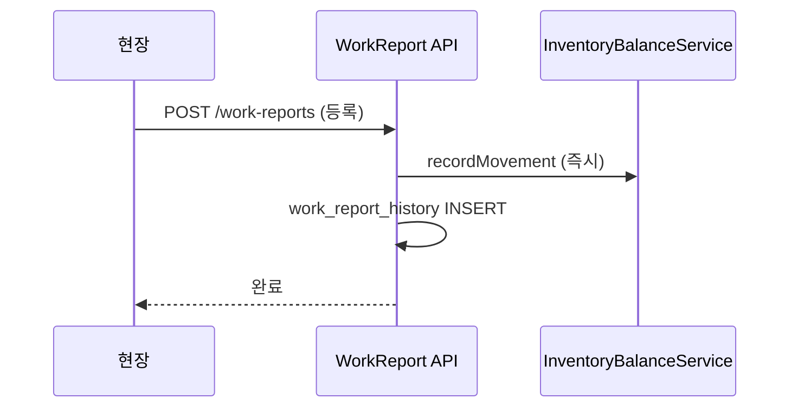

# 생산실적(`production_result`) → 작업일보 체계 매핑 설계안

> **문서 버전:** 1.1  
> **작성일:** 2026-06-22  
> **상태:** TO-BE 확정 — **PRD-W1c 구현 완료** / **PRD-W2는 [work-report-material-issue-spec.md](./work-report-material-issue-spec.md) 참조**  
> **관련 Wave:** TX2(현행 파일럿) → **PRD-W1**(작업계획·지시·일보)  
> **관련 문서:**  
> - [업무 흐름 TO-BE](./business-workflow-revision.md) §2.1  
> - [재고·원장 설계](./inventory-ledger-spec.md) §3.1a  
> - [기준정보 구현 설계](./basis-information-implementation-spec.md)

---

## 1. 문서 목적

TX2 `production_result`는 재고 검증용 단축 구현이다.  
본 문서는 **작업계획 → 작업지시 → 작업일보** 정식화 시 테이블·상태·**재고 반영 시점**·창고 이동을 정의한다.

**TO-BE UX:** 작업일보 **등록 1번 = 즉시 재고 반영**. DRAFT→전기(POST) **2단계 없음** ([business-workflow-revision.md](./business-workflow-revision.md) §2.1).

---

## 2. 현행(TX2) 요약

### 2.1 테이블

| 테이블 | 역할 |
|--------|------|
| `production_plan` | 생산계획 |
| `production_result` | 공정별 양품/스크랩 (작업일보 축소판) |
| `sales_shipment` | 제품출고 |

### 2.2 API

- `POST /api/v1/production/results` — **등록 즉시** 재고 이동 (TO-BE와 동일 원칙)

### 2.3 재고 로직 (TO-BE 확정)

```
작업일보 등록 시 (동기, 1트랜잭션):
  1. WIP[현재공정] OUT (양품 + 스크랩)
  2. 다음 사내 공정 있음 → WIP[다음] IN (양품)
  3. 최종 공정 (다음 없음) → SALES IN (양품)   ← 영업창고
```

> **폐기:** 최종 공정 → DELIVERY IN (v1.0 오류). DELIVERY는 **제품출고** 시에만 증가.

### 2.4 영업 연계

```text
제품출고   SALES OUT  →  DELIVERY IN
매출등록   DELIVERY OUT
```

### 2.5 한계 (PRD-W1에서 보완)

| 항목 | 내용 |
|------|------|
| 작업지시 없음 | `work_order` 도입 |
| 작업표준 미연계 | `work_standard` 참조 |
| 작업일보원장 없음 | `work_report_history` |
| 외주 | OUTSOURCE 공정 차단 유지 (INF-4) |

---

## 3. TO-BE 목표 구조

### 3.1 프로세스 (사내공정)

```text
production_plan
  → work_plan → work_order
      → work_report 등록 (1액션, 즉시 재고 + history)
```

외주 공정: INF-4 (`outsource_shipment` / `outsource_receipt`).

### 3.2 레거시 대응

| 신규 | 레거시 |
|------|--------|
| `work_plan` | 작업계획원장 |
| `work_order` | 작업지시 |
| `work_report` | 작업일보 / `ProductionResultPC` |
| `work_report_history` | 작업일보원장 |

---

## 4. 신규 테이블 설계

### 4.1 `work_plan` — (기존 v1.0 스키마 유지)

- UK: `(production_plan_id, process_sequence_id)`

### 4.2 `work_order` — (기존 v1.0 스키마 유지)

- `reported_qty`: 등록된 작업일보 양품 누적

### 4.3 `work_report`

```sql
CREATE TABLE work_report (
    id                  BIGINT AUTO_INCREMENT PRIMARY KEY,
    report_num          VARCHAR(50)    NOT NULL,
    work_order_id       BIGINT         NOT NULL,
    report_date         DATE           NOT NULL,
    good_qty            DECIMAL(18, 4) NOT NULL,
    scrap_qty           DECIMAL(18, 4) NOT NULL DEFAULT 0,
    setup_time          DECIMAL(10, 2) NULL,
    run_time            DECIMAL(10, 2) NULL,
    worker_id           VARCHAR(50)    NULL,
    worker_name         VARCHAR(100)   NULL,
    status              VARCHAR(20)    NOT NULL DEFAULT 'REGISTERED',
    stock_applied       TINYINT        NOT NULL DEFAULT 1,
    recording_state     TINYINT        NOT NULL DEFAULT 1,
    created_at          TIMESTAMP(3)   NOT NULL DEFAULT CURRENT_TIMESTAMP(3),
    created_by          VARCHAR(50)    NOT NULL,
    CONSTRAINT uk_work_report_num UNIQUE (report_num),
    CONSTRAINT fk_wr_wo FOREIGN KEY (work_order_id) REFERENCES work_order (id)
);
```

- **등록 시** `stock_applied=1`, 재고·`work_report_history` 동시 처리
- `status=CANCELLED` — 마감 전 역전기만 (별도 POST 없음)

### 4.4 `work_report_history`

등록과 **동일 트랜잭션**에 INSERT (`purchase_history` 패턴).

---

## 5. `production_result` → `work_report` 매핑

| `production_result` | `work_report` |
|---------------------|---------------|
| `result_num` | `report_num` |
| (간접) plan/process | `work_order` 경유 |
| `result_date` | `report_date` |
| `good_qty` / `scrap_qty` | 동일 |
| 즉시 재고 | 등록 = 재고 (동일) |

### 5.1 호환

- PRD-W1: `POST /production/results` → 내부 `work_report` 생성 + 재고 (Deprecated 래퍼)
- PRD-W2: `production_result` archive

---

## 6. 상태 정의

### 6.1 `work_report`

| status | stock_applied | 재고 | 설명 |
|--------|---------------|------|------|
| `REGISTERED` | 1 | **반영됨** | 등록 = 확정 (기본) |
| `CANCELLED` | 0 | 역전기 | 마감 전만 |

**DRAFT / POSTED / 전기 API 없음.**

### 6.2 `production_plan.produced_qty`

등록된 작업일보 **양품** 누적 (등록 즉시).

---

## 7. 재고 반영

### 7.1 원칙

| 구분 | 트리거 |
|------|--------|
| TX2 | `POST /production/results` |
| PRD-W1 | `POST /work-reports` **등록만** (별도 post 없음) |

### 7.2 재고 이동 알고리즘

```
등록 시 (good_qty, scrap_qty):
  1. WIP[현재] OUT (good + scrap)
  2. 다음 INHOUSE 공정 → WIP[다음] IN (good)
  3. 최종 공정 → SALES IN (good)
```

### 7.3 시퀀스



### 7.4 검사품목 (후속 PRD-W2)

공정 검사 필요 시에만 별도 Wave. PRD-W1 범위外.

### 7.5 PRD-W2 — 자재투입 분리 (2026-07-06 확정)

PRD-W1c MVP는 **완성품 실적만** 처리한다. BOM 1단계 투입·양품 기준 소요·**자재투입 TX 선행** 정책은  
[work-report-material-issue-spec.md](./work-report-material-issue-spec.md) 에 정의한다.

| 항목 | PRD-W1c | PRD-W2 |
|------|---------|--------|
| BOM backflush | 없음 | **없음** (투입 TX에서 처리) |
| 자재 소비 | — | `material_issue` |
| 작업일보 | 완성품 WIP/SALES | 동일 + **투입 충족 가드** |

---

## 8. API 설계

| 메서드 | 경로 | 재고 |
|--------|------|------|
| POST | `/api/v1/production/work-plans` | 없음 |
| POST | `/api/v1/production/work-orders` | 없음 |
| POST | `/api/v1/production/work-reports` | **있음 (등록 즉시)** |
| DELETE or POST | `/api/v1/production/work-reports/{id}/cancel` | 역전기 (선택) |
| GET | `/api/v1/production/work-reports/{id}` | — |

**없음:** `/work-reports/{id}/post`, `production:work-report:post` 권한

### 8.1 검증

| 규칙 | 내용 |
|------|------|
| OUTSOURCE 차단 | 작업일보 불가 |
| 지시 잔량 | good + scrap ≤ remaining |
| WIP 가용 | 현재 공정 WIP ≥ 투입 |
| 마감 | `FiscalCalendarService` + `month_closing` |

---

## 9. 서비스 구조

```text
WorkReportService.register()     -- 등록 + 재고 + history (1 TX)
WorkReportInventoryService       -- WIP/SALES 이동 (공통)
ProductionResultService          -- Deprecated → 위임
```

---

## 10. Wave

| Wave | 내용 |
|------|------|
| TX2 ✅ | `production_result` 즉시 재고 |
| PRD-W1 | work_plan/order/report, 등록=재고, 최종→**SALES** |
| PRD-W2 | production_result 이관·제거 |
| TX 영업 | sales_shipment, 매출 (DELIVERY) |

---

## 11. 의사결정 요약

| 항목 | TO-BE |
|------|-------|
| 재고 시점 | **작업일보 등록 즉시** |
| 최종 공정 | **SALES** IN |
| DELIVERY | **출고·매출**만 |
| 전기(POST) UI | **없음** |
| 작업지시 | 필수 (`work_order_id`) |

---

## 12. 문서 이력

| 버전 | 일자 | 내용 |
|------|------|------|
| 1.0 | 2026-06-22 | 초안 — DRAFT/POST 패턴 (폐기) |
| 1.1 | 2026-07-05 | TO-BE 1액션, 최종→SALES, DELIVERY=출고·매출, 전기 제거 |
