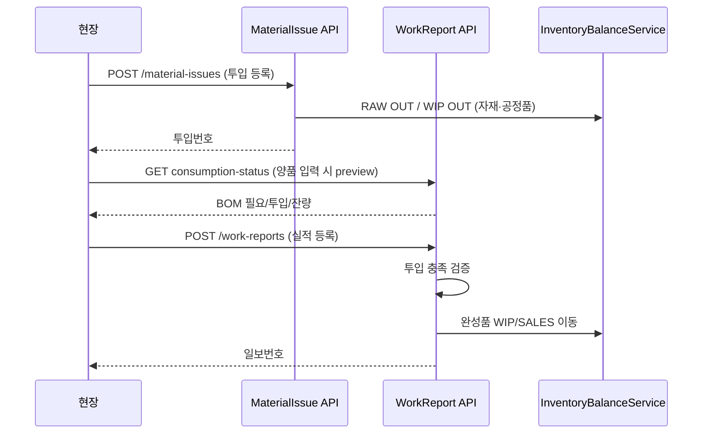

# 작업일보·자재투입 설계 (PRD-W2)

> **문서 버전:** 1.0  
> **작성일:** 2026-07-06  
> **상태:** TO-BE 확정 — **구현 대기**  
> **관련 Wave:** PRD-W2 (PRD-W1c 후속)  
> **관련 문서:**  
> - [production-work-report-mapping.md](./production-work-report-mapping.md) v1.1 (PRD-W1c MVP)  
> - [basis-item-composition-spec.md](./basis-item-composition-spec.md)  
> - [inventory-ledger-spec.md](./inventory-ledger-spec.md) §3.1a  
> - [business-workflow-revision.md](./business-workflow-revision.md) §2.1  
> - [mrp-work-plan-implementation-plan.md](./mrp-work-plan-implementation-plan.md)

---

## 1. 문서 목적

PRD-W1c 작업일보 MVP는 **완성품(작업지시 품목) 실적 1줄**만 처리한다.  
본 문서는 사용자 확정 정책에 따라 **자재투입 TX**와 **작업일보(실적 TX)** 를 분리하고, 작업일보 등록 UI에서 **1단계 BOM 투입 현황**을 보여 주는 설계를 정의한다.

---

## 2. 확정 의사결정 (2026-07-06)

| # | 항목 | 확정 |
|---|------|------|
| D1 | **공정별 BOM** | 공정 필터 **없음** — 모품목 기준 **1단계 BOM 전체** 표시 |
| D2 | **작업수량 기준** | **양품(`good_qty`)만** — 스크랩은 소요 산출·투입 대상 **아님** |
| D3 | **공정품 범위** | BOM **직접 자식**만 — 다단 전개·하위 공정품 재귀 **없음** |
| D4 | **MRP·발주와 관계** | **자재투입 TX 선행** → 작업일보는 **실적(완성품)만** — 등록 시 BOM backflush **금지** |

### 2.1 PRD-W1c와의 관계

| 구분 | PRD-W1c (현행) | PRD-W2 (본 문서) |
|------|----------------|------------------|
| 자재 소비 | 작업일보 등록 시 (미구현·WIP 부족 임시 우회) | **자재투입 TX** 전용 |
| 작업일보 재고 | 완성품 WIP/SALES 이동 | **동일** (실적만) |
| BOM UI | 없음 | 투입 **필요/실적/잔량** 그리드 |
| MRP | 발주·소요 산출 | 발주=**조달**, 투입=**현장 출고** (별도 원장) |

---

## 3. 업무 흐름 (TO-BE)

```text
작업지시 (work_order)
  │
  ├─① 자재투입 등록 (material_issue)     ← RAW / 공정품 WIP OUT (1액션=재고)
  │     · BOM 1단계 × 양품 기준 소요량
  │     · 작업지시·공정 단위 누적
  │
  └─② 작업일보 등록 (work_report)        ← 완성품 실적 + WIP/SALES (1액션=재고)
        · 양품·스크랩 입력
        · ① 누적 투입 ≥ 누적 양품 소요 가드
        · BOM 그리드 = 조회·잔량 확인 (투입 편집은 ①에서)
```



**UX:** [business-workflow-revision.md](./business-workflow-revision.md) §2.1 — 각 TX **등록 1번 = 재고 반영**, 별도 전기 UI 없음.

---

## 4. BOM 소요 산출

### 4.1 대상

| 항목 | 규칙 |
|------|------|
| 모품목 | `work_order` → `work_plan` → `production_plan.item_id` |
| BOM 범위 | `item_composition` **직접 자식** (`findActiveByParentItemId`) |
| 공정 필터 | **없음** (`process_management`, `sub_division` 미사용) |
| 자식 품목 | `원자재`, `공정품` (및 BOM에 등록된 기타 허용 자식 분류) |
| 제외 | 모품목 자기참조, 비활성 BOM, `recording_state=0` |

### 4.2 수량 공식

\[
\text{requiredQty(child)} = \text{goodQty} \times \frac{\text{childQuantity}}{\text{parentQuantity}}
\]

- `goodQty`: **양품만** (스크랩 제외)
- 반올림: `scale=4`, `HALF_UP` (MRP·BOM 전개와 동일)
- **누적 기준:** 작업지시에 대한 **누적 양품 실적** + **금번 등록 양품** 으로 필요량 산출

### 4.3 공정품 (D3)

| 규칙 | 내용 |
|------|------|
| 표시 | BOM **직접 자식** 중 `property_classification = 공정품` |
| 재귀 | **없음** — 손자 BOM 전개·다단 소요 **금지** |
| 재고 출처 | 해당 공정품의 **선행 사내공정 WIP** (아래 §6.2) |

---

## 5. 데이터 모델

### 5.1 `material_issue` (헤더)

```sql
CREATE TABLE material_issue (
  id                  BIGINT         NOT NULL AUTO_INCREMENT PRIMARY KEY,
  issue_num           VARCHAR(50)    NOT NULL,
  work_order_id       BIGINT         NOT NULL,
  issue_date          DATE           NOT NULL,
  status              ENUM('ISSUED','CANCELLED') NOT NULL DEFAULT 'ISSUED',
  recording_state     TINYINT        NOT NULL DEFAULT 1,
  created_by          VARCHAR(100)   NULL,
  created_by_id       VARCHAR(100)   NULL,
  created_at          DATETIME(3)    NOT NULL DEFAULT CURRENT_TIMESTAMP(3),
  updated_by          VARCHAR(100)   NULL,
  updated_by_id       VARCHAR(100)   NULL,
  updated_at          DATETIME(3)    NULL ON UPDATE CURRENT_TIMESTAMP(3),
  UNIQUE KEY uk_material_issue_num (issue_num, recording_state),
  INDEX idx_material_issue_wo (work_order_id, recording_state),
  CONSTRAINT fk_material_issue_wo FOREIGN KEY (work_order_id) REFERENCES work_order (id)
);
```

### 5.2 `material_issue_line`

```sql
CREATE TABLE material_issue_line (
  id                      BIGINT         NOT NULL AUTO_INCREMENT PRIMARY KEY,
  material_issue_id       BIGINT         NOT NULL,
  line_no                 SMALLINT       NOT NULL,
  item_id                 BIGINT         NOT NULL,
  item_composition_id     BIGINT         NULL,
  issue_qty               DECIMAL(18, 4) NOT NULL,
  source_location_code    VARCHAR(20)    NOT NULL,
  source_process_id       BIGINT         NULL,
  recording_state         TINYINT        NOT NULL DEFAULT 1,
  CONSTRAINT fk_mil_header FOREIGN KEY (material_issue_id) REFERENCES material_issue (id),
  CONSTRAINT fk_mil_item FOREIGN KEY (item_id) REFERENCES item (id),
  CONSTRAINT fk_mil_bom FOREIGN KEY (item_composition_id) REFERENCES item_composition (id)
);
```

| 컬럼 | 설명 |
|------|------|
| `item_composition_id` | BOM 라인 추적 (감사·역전기) |
| `source_location_code` | `RAW` 또는 `WIP` |
| `source_process_id` | 공정품 OUT 시 **선행 사내공정** `process_sequence.id` |

### 5.3 `work_report` (변경 없음, 검증만 추가)

- PRD-W1c 스키마 유지
- 등록 시 **누적 투입 ≥ 누적 양품 소요** 검증 추가 (§7.3)
- **BOM 라인 테이블 없음** — 투입은 `material_issue_line`이 원장

### 5.4 MRP·발주와의 FK

| 원장 | MRP/발주 FK | 정책 |
|------|-------------|------|
| `material_requirement_line` | 발주 `requirement_line_id` | **조달 계획** — 투입과 **직접 FK 없음** |
| `material_issue` | 없음 | 현장 **출고** — RAW/WIP 잔고만 검증 |
| `purchase_order_line` | MRP line | 입고 시 RAW IN — **투입은 별도 OUT** |

발주·입고는 **창고 적치**, 자재투입은 **생산 투입(출고)** — 이중 원장 허용, 수량은 각 TX에서 `InventoryBalanceService`로 검증.

---

## 6. 재고 이동

### 6.1 자재투입 (`MaterialIssueInventoryService`)

| 자식 분류 | OUT | IN | 비고 |
|-----------|-----|-----|------|
| **원자재** | `RAW` OUT | — | `referenceType=MATERIAL_ISSUE` |
| **공정품** | `WIP` OUT (`output_process_id`=선행 사내공정) | — | 선행 공정 WIP 잔고 검증 |

- **모품목 WIP IN 없음** — 투입은 **자재·공정품의 출고**만 기록
- `WipBalanceProjector.ensure` — 공정품 OUT 전 슬롯 ensure
- 원자재: `ProcessRepository.ensureMaterialProcess` **불필요** (RAW 슬롯)

**선행 사내공정 결정 (공정품):**

```text
공정품 item_id → plan 공정순서 중 INHOUSE/SPLIT
  → process_sequence_num 이 **모품목 현재 공정보다 작은** 것 중 **최대** (= 직전 사내공정)
  → 없으면 400 "선행 WIP를 찾을 수 없습니다"
```

### 6.2 작업일보 (`WorkReportInventoryService` — PRD-W2 정리)

| 단계 | 이동 |
|------|------|
| 현재 공정 | `WIP[모품목, 현재공정]` OUT (`good + scrap`) — **첫 사내공정 임시 skip 제거** |
| 다음 사내공정 | `WIP[모품목, 다음공정]` IN (`good`) |
| 최종 공정 | `SALES` IN (`good`) |

- **BOM/자재 OUT 없음** (D4) — 투입은 §6.1에서 이미 처리
- 스크랩: 현재 공정 WIP OUT만 (다음 공정·SALES IN **없음**)

### 6.3 inventory-ledger-spec 보완

[inventory-ledger-spec.md](./inventory-ledger-spec.md) §3.1a 에 추가:

```text
자재투입           → RAW OUT (원자재) / WIP OUT (공정품)
작업일보 등록       → WIP[모품] 이동 / 최종 SALES IN
```

---

## 7. API 설계

### 7.1 자재투입

| 메서드 | 경로 | 설명 |
|--------|------|------|
| GET | `/api/v1/production/material-issues/consumption-preview` | `workOrderId`, `goodQty`(양품) → BOM 1단계 소요 |
| POST | `/api/v1/production/material-issues` | 투입 등록 = 재고 즉시 |
| GET | `/api/v1/production/material-issues` | 목록 (작업지시·기간 필터) |
| POST | `/api/v1/production/material-issues/{id}/cancel` | 역전기 (마감 전) |

**`consumption-preview` 응답 예:**

```json
{
  "workOrderId": 1,
  "parentItemNo": "abc",
  "goodQty": 100,
  "lines": [
    {
      "itemCompositionId": 10,
      "itemId": 5,
      "itemNo": "RAW-001",
      "itemName": "볼트",
      "propertyClassification": "원자재",
      "requiredQty": 200.0000,
      "unitRatio": 2.0000
    },
    {
      "itemCompositionId": 11,
      "itemId": 8,
      "itemNo": "SUB-001",
      "itemName": "반제A",
      "propertyClassification": "공정품",
      "requiredQty": 50.0000,
      "sourceProcessId": 3,
      "sourceProcessName": "가공"
    }
  ]
}
```

**`POST material-issues` 본문:**

```json
{
  "workOrderId": 1,
  "issueDate": "2026-07-06",
  "lines": [
    { "itemCompositionId": 10, "issueQty": 200 },
    { "itemCompositionId": 11, "issueQty": 50 }
  ]
}
```

- 라인 `issueQty` ≤ preview `requiredQty` (금번 투입분)
- RAW/WIP **가용 재고** 검증

### 7.2 작업일보 (보강)

| 메서드 | 경로 | 변경 |
|--------|------|------|
| GET | `/api/v1/production/work-reports/consumption-status` | **신규** — 누적 양품 기준 필요/투입/잔량 |
| POST | `/api/v1/production/work-reports` | **가드 추가** — §7.3 |
| 기존 | cancel, list, report-targets | 유지 |

**`consumption-status` 응답 예** (작업일보 Modal용):

```json
{
  "workOrderId": 1,
  "cumulativeGoodQty": 150,
  "pendingGoodQty": 50,
  "lines": [
    {
      "itemNo": "RAW-001",
      "propertyClassification": "원자재",
      "requiredQty": 300.0000,
      "issuedQty": 300.0000,
      "remainingQty": 0,
      "satisfied": true
    },
    {
      "itemNo": "SUB-001",
      "propertyClassification": "공정품",
      "requiredQty": 75.0000,
      "issuedQty": 50.0000,
      "remainingQty": 25.0000,
      "satisfied": false
    }
  ],
  "allSatisfied": false
}
```

- `requiredQty` = `(reported_qty + pendingGoodQty) × BOM 비율`
- `issuedQty` = 해당 `work_order_id` 활성 `material_issue_line` 합계
- `remainingQty` = `max(0, required - issued)`

### 7.3 작업일보 등록 검증

| 규칙 | 내용 |
|------|------|
| V1 | `good + scrap ≤ work_order.remaining` |
| V2 | **누적 투입 ≥ 누적 양품 소요** (모든 BOM 직접 자식) |
| V3 | OUTSOURCE 공정 차단 |
| V4 | `monthClosingService.assertTransactionOpen` |
| V5 | 완성품 WIP 가용 (첫 공정 제외 시) |

V2 미충족 시: `400` — `"자재투입이 부족합니다: {itemNo} (필요 {required}, 투입 {issued})"`

---

## 8. UI 설계

### 8.1 메뉴

| 메뉴 ID | 라벨 | Wave |
|---------|------|------|
| `prod-material-issue` | **자재투입** | PRD-W2a |
| `prod-work-diary` | 작업일보 (보강) | PRD-W2b |

### 8.2 자재투입 화면

- **대상:** 잔량 있는 `work_order` (ISSUED)
- **입력:** 작업지시 선택, 투입일, **금번 양품 기준량** (또는 직접 라인 수량)
- **그리드:** BOM 1단계 — 품목, 분류, 단위소요, **필요량**, **투입량(입력)**, 가용재고
- **등록:** `POST material-issues` — 1액션

### 8.3 작업일보 Modal (보강)

```
┌─ 작업일보 등록 ─────────────────────────────────────┐
│ 지시: WO-…  품목: abc  공정: 조립  잔량: 500        │
│ 실적일 [____]  양품 [____]  스크랩 [____]  작업자   │
├─ 투입 현황 (1단계 BOM · 양품 기준) ─────────────────┤
│ 품목      │분류   │필요(누적)│투입(누적)│잔량│상태 │
│ RAW-001   │원자재 │ 300     │ 300     │ 0  │ OK  │
│ SUB-001   │공정품 │  75     │  50     │ 25 │ 부족│
├─────────────────────────────────────────────────────┤
│ ⚠ 투입 부족 시 등록 불가 — [자재투입] 메뉴에서 선행  │
│                              [닫기]  [등록]        │
└─────────────────────────────────────────────────────┘
```

- BOM 그리드: **읽기 전용** (투입 편집은 자재투입 화면)
- `pendingGoodQty` 변경 시 `consumption-status` 재조회
- `allSatisfied=false` → 등록 버튼 비활성

---

## 9. 서비스 구조

```text
application/production/
  BomConsumptionCalculator          -- 1단계 BOM × goodQty
  MaterialIssueService              -- register / cancel (1 TX)
  MaterialIssueInventoryService     -- RAW OUT, WIP OUT
  WorkReportService                 -- register: V2 가드 + 기존 실적
  WorkReportInventoryService        -- 완성품만 (backflush 제거)

infrastructure/
  JpaMaterialIssueRepository
  MaterialIssueApplicationService
  WorkReportApplicationService      -- 기존 확장

api/
  MaterialIssueController
  WorkReportController              -- consumption-status 추가

frontend/
  MaterialIssuePage.tsx
  WorkReportPage.tsx                  -- BOM 그리드 + 가드
  api/materialIssue.ts
```

**재사용:**

- `ItemCompositionRepository.findActiveByParentItemId`
- `InventoryBalanceService.recordMovement`
- `ProcessRepository.findAllActiveByItemId` (공정품 선행 공정)
- `PurchaseReceiptService` 패턴 (등록=재고 1 TX)

---

## 10. 구현 Wave (PRD-W2)

| 순서 | ID | 작업 | 산출물 |
|------|-----|------|--------|
| 1 | W2a | Flyway `material_issue` + 권한 | `V041__material_issue.sql` |
| 2 | W2a | `BomConsumptionCalculator`, `MaterialIssueService` | API + `MaterialIssuePage` |
| 3 | W2b | `consumption-status`, work_report V2 가드 | `WorkReportPage` BOM 그리드 |
| 4 | W2b | `WorkReportInventoryService` **첫 공정 skip 제거** | 재고 정합 |
| 5 | W2c | (선택) `material_issue_history` / 이력 조회 | purchase_history 패턴 |

**권한 시드:**

```text
production:material-issue:read
production:material-issue:write
```

---

## 11. PRD-W1c 마이그레이션 노트

| 현행 코드 | PRD-W2 조치 |
|-----------|-------------|
| `WorkReportInventoryService.isFirstInhouseProcess` skip | **제거** — 투입 TX가 선행 WIP 공급 |
| 작업일보 단독 등록 | **투입 충족 후**만 허용 (데이터 없으면 400) |
| MRP 발주 데이터 | 변경 없음 — 입고→RAW, 투입→RAW OUT |

**운영 전환:** 기존 작업일보만 있고 투입 이력 없는 작업지시는 **일회성 투입 backfill** 또는 **신규 지시부터** 정책 적용 (구현 시 선택).

---

## 12. 체크리스트 (구현 시)

- [ ] `V041` material_issue + line + permission
- [ ] `BomConsumptionCalculator` — 1단계, 양품만, scale 4
- [ ] `MaterialIssueService.register` — RAW/WIP OUT, 재고 검증
- [ ] `GET consumption-preview`, `POST material-issues`, cancel
- [ ] `MaterialIssuePage` + menu `prod-material-issue`
- [ ] `GET work-reports/consumption-status`
- [ ] `WorkReportService` V2 가드 (누적 투입 ≥ 누적 양품 소요)
- [ ] `WorkReportPage` BOM 그리드 (읽기 전용)
- [ ] `WorkReportInventoryService` — first process skip 제거
- [ ] `inventory-ledger-spec` §3.1a 자재투입 한 줄 추가
- [ ] 통합 시나리오: 입고(RAW) → 투입 → 일보 → SALES 잔고 확인

---

## 13. 문서 이력

| 버전 | 일자 | 내용 |
|------|------|------|
| 1.0 | 2026-07-06 | 초안 — D1~D4 확정, 자재투입/작업일보 분리, API·UI·재고 |
